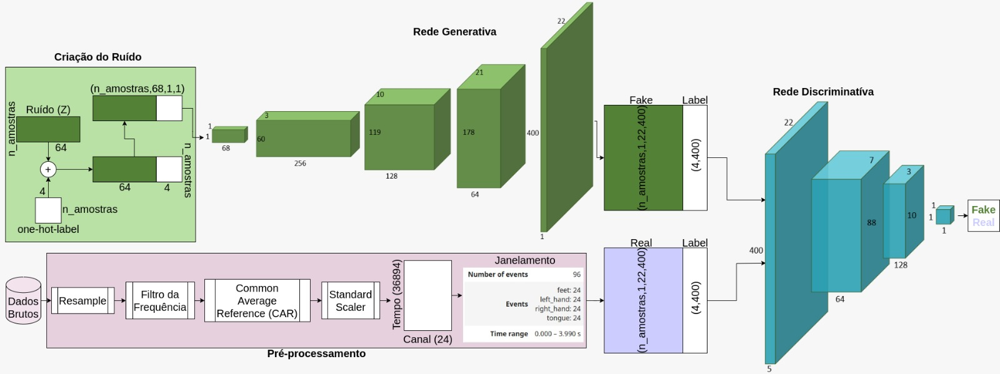
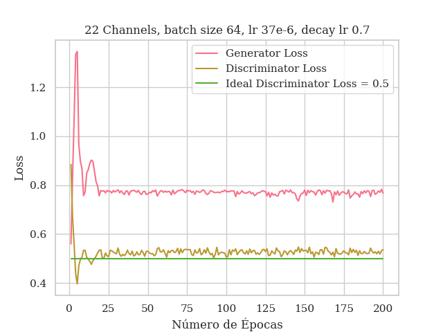
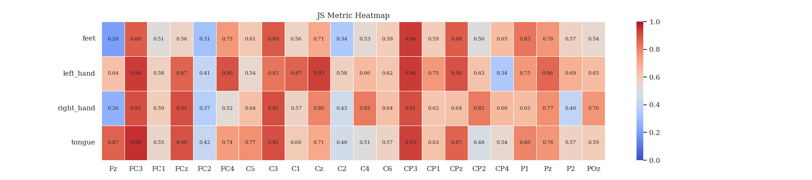
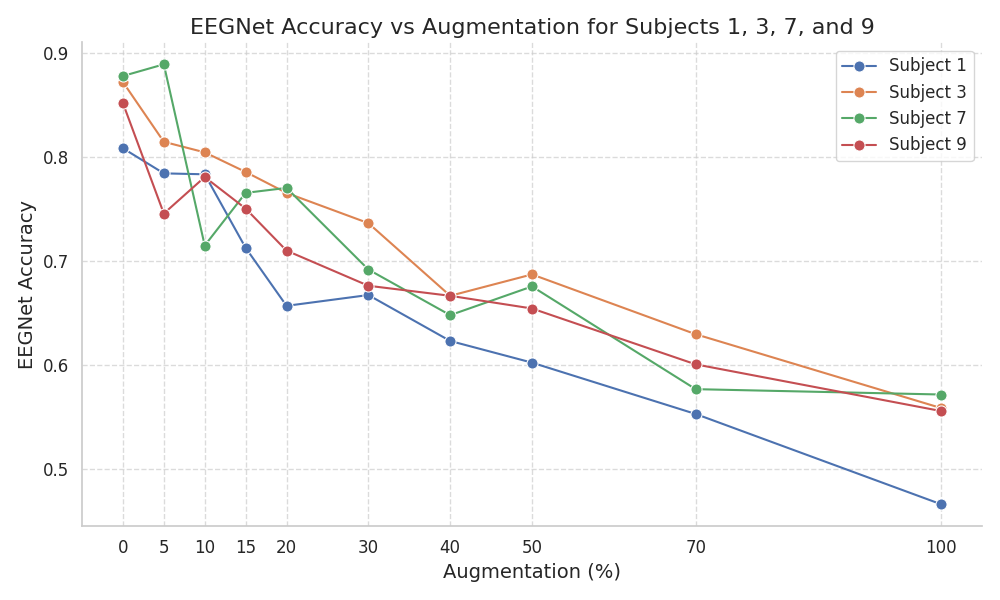

# Estudo de Caso: Síntese de Dados de EEG utilizando Redes Generativas Adversárias
# Case Study: EEG Data Synthesis through Generative Adversarial Networks

## Apresentação

O presente projeto foi originado no contexto das atividades da disciplina de pós-graduação *IA376L - Deep Learning aplicado a Síntese de Sinais*, 
oferecida no segundo semestre de 2023, na Unicamp, sob supervisão da Profa. Dra. Paula Dornhofer Paro Costa, do Departamento de Engenharia de Computação e Automação (DCA) da Faculdade de Engenharia Elétrica e de Computação (FEEC).

|Nome  | RA | Especialização|
|--|--|--|
| Joany Rodrigues  | 264440  | Eng. de Computação|
| João Guilherme Prado Barbon  | 262760  | Eng. Físico|
| Larissa Rangel de Azevedo  | 247008  | Eng. Eletricista|

## Apresentação Final
[Link](https://docs.google.com/presentation/d/1Ex3XsNcepdOteejq16PSALgOvTHAFdkS/edit?usp=sharing&ouid=106498812395082097833&rtpof=true&sd=true&authuser=2) para apresentação final.

## Descrição Resumida do Projeto
<!-- Este projeto tem como objetivo sintetizar dados de eletroencefalografia (EEG) gerados por uma interface cérebro-computador (BCI) utilizando o paradigma de imagética motora. A principal motivação da implementação de uma BCI é o estudo e a compreensão do cérebro, abrindo portas para aplicações na área da saúde e entretenimento. A abordagem do paradigma da imagética motora ocorre pela aquisição dos sinais cerebrais gerados pela imaginação ou realização do movimento de partes do corpo, como membros superiores (braços) ou inferiores (pernas). Assim, os dados sintéticos serão gerados a partir de uma Rede Generativa Adversária (GAN), que apresentará como saída séries temporais representativas dos sinais reais de EEG.  
 -->
Este projeto tem como objetivo sintetizar dados de eletroencefalografia (EEG) gerados por uma interface cérebro-computador (BCI, do inglês Brain-Computer Interface) utilizando o paradigma de imagética motora. Esse sistema apresenta um vasto potencial para aplicações inovadoras, com benefícios notáveis, sobretudo considerando a população que enfrenta diversos tipos de deficiências (sejam elas visuais, auditivas, motoras ou cognitivas), bem como o crescente mercado das tecnologias assistivas e interativas. A principal motivação subjacente à implementação das BCIs é o estudo e a compreensão do funcionamento cerebral, abrindo caminhos para aplicações nos campos da saúde e entretenimento. 

Uma abordagem notável dentro desse contexto é a utilização do paradigma de imagética motora, que envolve a aquisição de sinais cerebrais gerados pela imaginação ou execução de movimentos de partes do corpo, como membros superiores (braços) e inferiores (pernas). Buscando uma melhor reprodutibilidades desses sinais, a geração de dados sintéticos será realizada por meio de uma Rede Generativa Adversária (GAN), que produzirá séries temporais dos sinais de EEG reais. Tal abordagem oferece a capacidade de criar conjuntos de dados EEG diversificados e representativos, que podem ser usados para desenvolver e aprimorar sistemas BCI de classificação, tornando-os mais precisos e eficazes e abrangendo uma ampla variedade de cenários e condições. 

[Vídeo da Apresentação - 1ª entrega ](https://drive.google.com/file/d/1T1XJYjW1v4Qm5PvELuSoJu00xOpP94OW/view)

## Metodologia Proposta
- A base de dados que será utilizada é a [BNCI2014_001](https://moabb.neurotechx.com/docs/generated/moabb.datasets.BNCI2014_001.html#r55ebd47d0fe7-1), que consiste em dados de EEG de nove indivíduos, com quatro classes de movimento diferentes: movimento da mão esquerda (classe 1), da mão direita (classe 2), de ambos os pés (classe 3) e da lingua (classe 4). Este dataset foi utilizado no Review BCI Competition 4, sendo portanto bem documentado e testado.
- Como principal modelo generativo, serão utilizadas GANs para geração dos dados sintéticos. Como abordagem, utilizamos uma Conditional DCGAN, inspirada no artigo [EEG-GAN](https://arxiv.org/abs/1806.01875).
- Outro artigo de referência utilizado analisa o impacto do aumento de dados sintéticos de EEG na avaliação de classificadores - [Augmenting EEG with Generative Adversarial Networks Enhances Brain Decoding Across Classifiers and Sample Sizes](https://escholarship.org/uc/item/9gz8g908)
-  As ferramentas utilizadas serão:
    - Linguagem:  Python
    - Biblioteca: Pythorch
    - Ambiente: Google Colab e Kaggle
  
- Os resultados esperados são distribuições de dados sintéticos de EEG que melhor se aproximam das distribuições reais. Para verificar se as distribuições são compatíveis, mapeou-se os dados para um manifold de menor dimensão utilizando Variational Autoencoder. Como métricas de avaliação, utilizou-se a divergência de Jensen–Shannon, a acurácia do classificador EEGNet e histogramas da distribuição estatística dos dados.
### Bases de Dados e Evolução

|Base de Dados | Endereço na Web | Resumo descritivo|
|----- | ----- | -----|
|BNCI2014_001| https://encurtador.com.br/lpsAK| Dados de EEG de 9 indivíduos, adquiridos por meio 22 eletrodos dispostos no escalpo de cada indivíduo, durante o experimento de realização de 4 movimentos diferentes. 

<!---

> Faça uma descrição sobre o que concluiu sobre esta base. Sugere-se que respondam perguntas ou forneçam informações indicadas a seguir:
>
> 
> * Qual o formato dessa base, tamanho, tipo de anotação? 
-->

 A base de dados utilizada possui formato "braindecode.datasets.moabb.MOABBDataset", que é o formato padrão da toolboox Braindecode.  O [Braindecode](https://braindecode.org/stable/index.html) é uma biblioteca open-source em Python usada decodificar dados brutos de EEG, ECoG e MEG, contendo funções como dataset fetchers, ferramentas de pré-processamento e visualização de dados, além de algumas arquiteturas de aprendizado profundo.

 Em seu formato original, para apenas um indivíduo, a base possui 12 runs, sendo seis runs de treinamento e seis de validação. Uma run contém dados de EEG totalizando 6:27 minutos, coletados através de 22 eletrodos com frequências entre 0 Hz e 125 Hz, e amostragem de 250 Hz (ou seja, 250 amostras por segundo). No formato tensorial, uma run pode ser descrita como uma matriz de (96750 x 22), onde as linhas são as medições e as colunas os respectivos eletrodos.

<!---
> * Quais as transformações e tratamentos feitos? Limpeza, reanotação, etc.
your comment goes here
and here
-->

As transformações foram feitas usando a biblioteca 'braindecode.preprocessing.Preprocessor', que  aplica a função de pré-processamento fornecida aos dados brutos. 
A primeira transformação realizada foi uma reamostragem para 100 Hz e uma filtragem utilizando um filtro passa faixas com frequências de corte de 4 e 38 Hz, para eliminar frequências irrelevantes, por exemplo  60 Hz oriunda da rede elétrica. Além disso, foi utilizado um filtro CAR - [Common Average Reference](https://pressrelease.brainproducts.com/referencing/#:~:text=When%20applying%20the%20so%2Dcalled,resulting%20signal%20from%20each%20channel.) - para remover os ruídos internos e externos, e os dados normalizados utilizando [Starndard Scale](https://scikit-learn.org/stable/modules/generated/sklearn.preprocessing.StandardScaler.html). 

Por último, foi feito o janelamento dos dados em janelas de  4s (400 amostras) para dividir os dados entre as 4 classes e reduzir a quantidade de amostras processadas pelo o algoritmo, melhorando também o tempo de processamento. Neste processamento, todos os 22 eletrodos foram utilizados. Abaixo está um exemplo de sinal de EEG no domínio da frequência para todos os eletrodos.

|**EEG Channels Frequency Curve**|
|:--:| 


<!---
> * Inclua um sumário com estatísticas descritivas da(s) base(s) de estudo.
-->

A tabela a seguir mostra as estatísticas descritivas da base de estudo após o pré-processamento, sendo Q1 o primeiro quartil e Q3 o terceiro quartil.  

| ch  | name  | type | unit | min           | Q1          | median  | Q3          | max          |
|----:|-------|------|------|--------------:|------------:|--------:|------------:|------------:|
|   0 | Fz    | EEG  | µV   | -23197412.26  | -2764233.74 | -59893.33 | 2689774.31  | 24117502.14 |
|   1 | FC3   | EEG  | µV   | -16092798.07  | -2262880.58 |  9058.88 | 2221504.87  | 16416656.78 |
|   2 | FC1   | EEG  | µV   | -19583299.93  | -2197222.31 | -3899.04 | 2155626.09  | 16767533.19 |
|   3 | FCz   | EEG  | µV   | -20189703.99  | -2348475.26 | -34185.20 | 2288364.73  | 17884609.01 |
|   4 | FC2   | EEG  | µV   | -16651394.00  | -2096426.26 | -17829.59 | 2072305.99  | 17704307.52 |
|   5 | FC4   | EEG  | µV   | -17091787.21  | -2257461.58 | -16192.81 | 2252035.06  | 17556741.76 |
|   6 | C5    | EEG  | µV   | -16363957.84  | -2464807.19 |  28147.23 | 2456031.64  | 21078452.11 |
|   7 | C3    | EEG  | µV   | -21211591.44  | -1746918.71 |  33566.48 | 1796777.18  | 21687721.12 |
|   8 | C1    | EEG  | µV   | -23428939.98  | -1387423.47 |  11196.68 | 1404395.06  | 30463036.86 |
|   9 | Cz    | EEG  | µV   | -14918655.42  | -1643685.54 |  -6336.32 | 1638304.56  | 14533799.88 |
|  10 | C2    | EEG  | µV   | -10423506.98  | -1388777.30 |   3095.53 | 1406398.20  | 10402446.50 |
|  11 | C4    | EEG  | µV   | -17684305.36  | -1813621.59 |  17419.43 | 1840669.03  | 12688415.45 |
|  12 | C6    | EEG  | µV   | -21559642.80  | -2631099.24 | -12882.52 | 2641556.70  | 23328653.66 |
|  13 | CP3   | EEG  | µV   | -17972880.92  | -2152442.25 | 61684.71 | 2240892.25  | 15908321.92 |
|  14 | CP1   | EEG  | µV   | -14620068.46  | -1444056.81 | 37891.09 | 1482102.75  | 18123839.36 |
|  15 | CPz   | EEG  | µV   | -13303892.60  | -1416615.66 |   762.69 | 1422849.62  | 12948253.60 |
|  16 | CP2   | EEG  | µV   | -11823591.95  | -1329206.34 | 16067.51 | 1362674.56  | 10213997.18 |
|  17 | CP4   | EEG  | µV   | -25137329.68  | -2018397.32 | 34057.89 | 2061892.99  | 16786867.70 |
|  18 | P1    | EEG  | µV   | -19384165.37  | -2311265.52 | 55445.33 | 2338381.92  | 19757396.00 |
|  19 | Pz    | EEG  | µV   | -24524615.78  | -2097203.73 | 20822.05 | 2128965.70  | 15253330.64 |
|  20 | P2    | EEG  | µV   | -30192611.43  | -2272931.93 |   255.07 | 2316270.46  | 18435264.58 |
|  21 | POz   | EEG  | µV   | -36473536.55  | -3385989.48 | -12468.79 | 3385965.87  | 29828793.42 |


<!---
> * Utilize tabelas e/ou gráficos que descrevam os aspectos principais da base que são relevantes para o projeto.
> -->

##### As informações relevantes da base de dados usadas para o projeto são:

Informações  | Descrição
--------- | ------
Eletrodos | 'Fz','FC3','FC1','FCz','FC2','FC4','C5','C3','C1','Cz','C2','C4','C6','CP3','CP1','CPz','CP2','CP4','P1','Pz','P2','POz'
Runs | 12
Janelas por Run | 96
Janelas por Classe| 24
Classes | 'feet': 0, 'left_hand': 1, 'right_hand': 2, 'tongue': 3
Tempo por Janela | 4s
Amostras por Janela | 400


## Workflow
** Joany Gerar Figura** 

Workflow da proposta de geração de dados sintéticos.

 A rede generativa contém 4 camadas convoluvionais que recebem como entrada ruído de dimensão (n_amostras,68,1,1) e retorna dados sintéticos de dimensão (n_amostras,1,22,400). O discriminador possui duas camadas convolucionais para classificação dados em reais ou falsos. Na figura, utilizou-se n_amostras = 4

|**Workflow**|
|:--:| 


A arquitetura da CGAN utilizada neste trabalho pode ser encontrada neste [link](https://github.com/jbarbon/dgm-2023.2/blob/main/projetos/EEG_Data_Synth/notebooks/GANs/MyGAN.py).


### Criação de ruído
O ruído para o treinamento do gerador foi criado pela amostragem de dados aleatórios de uma distribuição normal, utilizando a função `torch.randn`. Além do ruído, gerado com dimensão `(n_amostras,64)`, também é criado um tensor de labels no formato one-hot encoding para este sinal, com dimensão `(n_amostras,4)`. Para obter a entrada final do gerador, concatena-se o ruído com as labels dos dado reais, com dimensão `(n_amostras, 68)`. Por fim, é realizada uma conversão para transformar o ruído no formato tensorial dos dados de EEG, `(n_amostras,68,1,1)`.

### Rede generativa
A rede generativa possui quatro camadas convolucionais, que recebe o sinal de ruído de dimensão `(n_amostras,68,1,1)` e gera um sinal falso de EEG de dimensão `(n_amostras,1,22,400)`. As três primeiras camadas realizam as operações:

```python
nn.ConvTranspose2d(64, 256, kernel_size = (3,60), stride = (1,1)),
nn.BatchNorm2d(272),
nn.ReLU(inplace=True),

nn.ConvTranspose2d(256, 128, kernel_size = (4,60), stride = (3,1)),
nn.BatchNorm2d(136),
nn.ReLU(inplace=True),

nn.ConvTranspose2d(128, 64, kernel_size = (3,60), stride = (2,1)),
nn.BatchNorm2d(68),
nn.ReLU(inplace=True),

```

A última camada realiza uma convolução transposta acompanhada de uma função de ativação Tanh:

```python
    nn.ConvTranspose2d(64, 1, kernel_size = (2,50), stride = (1,2), padding = (0,2)),
    nn.Tanh()
```

### Rede discriminativa
A rede discriminativa classifica os dados de entrada como reais ou falsos. Ela recebe como entrada um tensor do sinal de EEG concatenado com os labels de cada amostra, produzindo um tensor de dimensão `(n_amostras,5,22,400)`. Esta rede possui três camadas convolucionais que realizam as seguintes operações:

```python
    # Layer 1
    nn.Conv2d(5, 64,   kernel_size = (4,50), stride = (3,4)),
    nn.BatchNorm2d(64),
    nn.LeakyReLU(0.2, inplace=True)

    # Layer 2
    nn.Conv2d(64, 128,  kernel_size = (3,50), stride = (2,4)),
    nn.BatchNorm2d(128),
    nn.LeakyReLU(0.2, inplace=True)

    # Layer 3
    nn.Conv2d(128, 1,  kernel_size = (3,10), stride = (1,1)),

```

### Configuração de treinamento da GAN

O treinamento da GAN foi feito com os dados EEG do indivíduo três do dataset, utilizando todas as 12 runs (treino + validação). Todos os eletrodos foram selecionados e as classes `'feet': 0, 'left_hand': 1, 'right_hand': 2, 'tongue': 3` de cada amostra foi transformada no formato one-hot encoding para posterior concatenação com o ruído de entrada no gerador e com os dados da entrada do classificador.

As configurações de treinamento da rede e o algoritmo de treinamento são mostrados a seguir:

| Parâmetros | Valor | 
|:---------:|:-----:|
|Número de épocas|200|
|Dimensão do ruído|64|
|Tamanho do batch| 64|
|Learning Rate| 3.7e-5|
|Decay Rate| 0.7|
|Loss Function|`nn.BCEWithLogitsLoss`|


### Algoritmo de Treinamento da CGAN

#### Passo 1: Inicialização
- Para cada época no número total de épocas (n_epochs):
  - Para cada lote de imagens reais e suas labels no conjunto de dados:
    - Converta os dados reais em tensores e mova para o dispositivo de processamento (GPU).

#### Passo 2: Atualizar o Discriminador
- Zere os gradientes do discriminador.
- Gere dados EEG falsos usando o gerador:
  - Combine os vetores de ruído falsos com as labels one-hot correspondentes.
  - Gere os dados EEG falsos condicionados.
- Obtenha as previsões do discriminador para dados falsos e reais:
  - Crie a entrada para o discriminador:
    - Combine as imagens falsas com labels one-hot e desconecte o gerador para não retropropagar.
    - Combine as imagens reais com labels one-hot.
  - Obtenha a previsão do discriminador para os dados falsos.
  - Obtenha a previsão do discriminador para os dados reais.
- Calcule as perdas do discriminador:
  - Calcule a perda para dados falsos usando uma função de perda que compara as previsões com um vetor de zeros.
  - Calcule a perda para dados reais usando a mesma função de perda, comparando as previsões com um vetor de uns.
- Calcule a perda total do discriminador como a média das perdas para dados falsos e reais dividida por dois.
- Realize a retropropagação das perdas e atualize os gradientes do discriminador.
- Armazene a perda média do discriminador na lista de perdas do discriminador.

#### Passo 3: Atualizar o Gerador
- Zere os gradientes do gerador.
- Crie novamente a entrada para o discriminador usando os dados EEG falsos gerados e as labels one-hot.
- Obtenha as previsões do discriminador para os dados EEG falsos gerados.
- Calcule a perda do gerador usando a função de perda que compara as previsões com um vetor de uns (indicando que os dados falsos devem parecer reais).
- Realize a retropropagação da perda e atualize os gradientes do gerador.


## Métricas de avaliação

### Classificador
Utilizou-se uma implementação do classificador [EEGNetV4](https://braindecode.org/stable/generated/braindecode.models.EEGNetv4.html) da biblioteca ``braindecode`` para classificar as labels dos dados de EEG. A estrutura do classificador foi baseada no artigo [EEGNet](https://arxiv.org/abs/1611.08024), e os parâmetros de treinamento utilizados foram os padrões da biblioteca, adaptados aos nossos dados:

```python
n_epochs = 300

model = EEGNetv4(
      in_chans = 22,
      n_classes = 4,
      input_window_samples= 400,
      final_conv_length='auto',
      F1=8,
      D=2,
      F2=8,
      kernel_length=64,
      drop_prob=0.5
)
 ```

Nesta métrica, o objetivo é, inicialmente, treinar o classificador no conjunto completo de dados reais de EEG, obtendo um valor base de acurácia. Após o treinamento da GAN, utiliza-se o gerador para gerar novas amostras que irão compor o conjunto original de dados, processo conhecido como data augmentation. Espera-se, portanto, que o classificador treinado neste novo conjunto de dados (reais + falsos) apresente melhores valores de acurácia, melhorando o processo de classificação dos movimentos para este paradigma cérebro-computador. Foram utilizados diferentes valores de augmentation para comparação da eficiência na classificação: 

   ``0% (base), '5%', '10%', '20%', '50%', '70%', '100%', '200%' ``


### Divergencia de Jensen Shannon (JS)
<!-- A divergencia de Jensen Shannon é uma métrica que mede o quanto duas distribuições divergem entre si. É baseado na divergência de Kullback-Leibler, mas é simétrica. Utilizamos a biblioteca scipy para [implementação](https://github.com/jbarbon/dgm-2023.2/tree/main/projetos/EEG_Data_Synth/notebooks/GANs/JS_metric.ipynb). -->

A divergência de Jensen-Shannon é um método para medir a similaridade entre duas distribuições de probabilidade. Ela é baseada na divergência de Kullback-Leibler, com simetria entre as distribuições e sempre com um valor finito. A raiz quadrada da divergência de Jensen-Shannon é referida como a distância de Jensen-Shannon.

A fórmula para calcular a divergência de Jensen-Shannon é uma combinação ponderada das divergências de Kullback-Leibler entre as distribuições de probabilidade de interesse e sua média. Isso resulta em uma medida que captura tanto as semelhanças quanto as diferenças entre as distribuições, tornando-a uma métrica valiosa para tarefas de classificação, clusterização e recuperação de informações. A implementação utilizada neste trabalho pode ser encontrada neste [link](https://github.com/jbarbon/dgm-2023.2/tree/main/projetos/EEG_Data_Synth/notebooks/GANs/JS_metric.ipynb).


### Histogramas

Histogramas foram utilizados para comparação visual entre as distribuições dos canais dos dados reais e dados sintéticos, na proporção de 1:1. Para análise, foram escolhidos três eletrodos posicionados na região motora do cérebro (Cz, C3 e C4) e dois eletrodos cujo valor de divergência de JS mais variaram de indivíduo para indivíduo (FC2, C2). 


# Resultados

## Resultados para o terceiro indivíduo
Nesta seção inicial, apresentam-se os resultados relacionados aos dados de EEG provenientes do indivíduo 3, uma vez que ele foi utilizado como referência para o ajuste fino dos parâmetros. Na próxima seção, será realizada uma comparação dos resultados entre os indivíduos 1, 3, 7 e 9.


### Curvas de Loss da GAN

Ao final do treinamento da GAN, gerou-se um gráfico exibindo as curvas de perda para o gerador e o discriminador em função das épocas. A figura abaixo ilustra o comportamento observado para a melhor arquitetura e parâmetros encontrados, com o discriminador convergindo para valores de perda muito próximos `0.5`, e o gerador convergindo para valores próximos de `0.8`, ambos resultados indesejáveis no treinamento. 

|**Convergência da curva de loss do gerador e discriminador**|
|:--:| 

### Classificador
A acurácia do classificador para os dados aumentados são mostrados na tabela abaixo. Nota-se que o acréscimo na precisão devido à aplicação de data augmentation foi relativamente pequeno, com um aumento de cerca de 2% para incrementos de 5% e 50%.

Os resultados destacam que o modelo respondeu de forma moderada ao aumento dos dados, indicando, de maneira geral, que a implementação de técnicas de aumento de dados trouxe uma melhoria, ainda que sutil, no desempenho do classificador EEGNet.

Ainda assim, é importante considerar a variabilidade individual entre os participantes nos testes, uma vez que distintas respostas neurais podem influenciar a eficácia do modelo.

| Augmentation (%) | EEGNet Accuracy |
|-------------------|-----------------|
| 0.0               | 0.8976          |
| 5.0               | 0.9167          |
| 10.0              | 0.9010          |
| 20.0              | 0.8993          |
| 50.0              | 0.9184          |
| 70.0              | 0.8941          |
| 100.0             | 0.8976          |
| 200.0             | 0.8802          |


### Métrica Jensen–Shannon (JS)
A divergência de Jensen-Shannon (JS) foi calculada entre os dados reais e os dados gerados pela rede generativa condicional. Essa métrica é utilizada para avaliar a "distância" ou similaridade entre duas distribuições de probabilidade, sendo que  valores menores dessa métrica indicam que as distribuições estão mais próximas, enquanto valores maiores indicam que as distribuições são mais distintas. A comparação foi realizada para cada classe e para cada canal das duas distribuições. Ambos conjuntos de dados reais possuem dimensão (1152, 3), representando 288 amostras para cada classe em cada um dos três canais. 


A tabela abaixo apresenta os valores da métrica JS calculados para cada classe e eletrodo. Observa-se que os valores são relativamente altos, sugerindo que as distribuições estão distantes uma da outra. As distribuições do eletrodo Cz, no entanto, apresentam maior similaridade nas classes "left hand" e "tongue", não indicando necessariamente o sucesso na geração dos dados, uma vez que o treinamento da CGAN não ocorreu como o esperado.

|**Heatmap**|
|:--:| 


### Histogramas de Distribuição


|**Histogramas**|
|:--:| 

## Resultados para o terceiro indivíduo
Falar sobre a variabilidade dos indivíduos no processo de aquisição de dados. 
Falar sobre o impacto disso no classificador

|**EEGNet_Accuracy_vs_Augmentation**|
|:--:| 

## Comparação dos manifolds gerados pelo VAE

<!--
## Experimentos, Resultados e Discussão dos Resultados

> Na entrega parcial do projeto (E2), essa seção pode conter resultados parciais, explorações de implementações realizadas e 
> discussões sobre tais experimentos, incluindo decisões de mudança de trajetória ou descrição de novos experimentos, como resultado dessas explorações.

> Na entrega final do projeto (E3), essa seção deverá elencar os **principais** resultados obtidos (não necessariamente todos), que melhor representam o cumprimento
> dos objetivos do projeto.

> A discussão dos resultados pode ser realizada em seção separada ou integrada à seção de resultados. Isso é uma questão de estilo.
> Considera-se fundamental que a apresentação de resultados não sirva como um tratado que tem como único objetivo mostrar que "se trabalhou muito".
> O que se espera da seção de resultados é que ela **apresente e discuta** somente os resultados mais **relevantes**, que mostre os **potenciais e/ou limitações** da metodologia, que destaquem aspectos
> de **performance** e que contenha conteúdo que possa ser classificado como **compartilhamento organizado, didático e reprodutível de conhecimento relevante para a comunidade**. 

 ## Cronograma
> Proposta de cronograma.

|                                       | Setembro     |             | Outubro     |             | Novembro    |             |
|:-------------------------------------:|:------------:|:-----------:|:-----------:|:-----------:|:-----------:|:-----------:|
| **Atividades**                            | 1ª quinzena  | 2ª quinzena | 1ª quinzena | 2ª quinzena | 1ª quinzena | 2ª quinzena |
| **Primeira Entrega**                    | ✔            |             |             |             |             |             |
| Definição do tema                     | ✔            |             |             |             |             |             |
| Levantamento bibliográfico            | ✔            |             |             |             |             |             |
| Escolha da base de dados              |✔            |             |             |             |             |             |
| Escrita da proposta de projeto        | ✔            |             |             |             |             |             |
| **Segunda Entrega**                   |              |             |             |             |             |             |
| Pré-processamento dos dados           |              | X           |             |             |             |             |
| Levantamento bibliográfico           |              | X           |             |             |             |             |
| Reprodução dos resultados do artigo   |              |             | X           | X           |             |             |
| Avaliação dos resultados preliminares |              |             |             | X           |             |             |
| **Entrega Final**                         |              |             |             |             |             |             |
| Consolidação da síntese dos dados     |              |             |             |             | X           |             |
| Resultado das métricas de avaliação   |              |             |             |             | X           | X           |
| Escrita final do projeto              |              |             |             |             |             | X           |
-->
## Conclusão

<!--
> A seção de Conclusão deve ser uma seção que recupera as principais informações já apresentadas no relatório e que aponta para trabalhos futuros.
> Na entrega parcial do projeto (E2) pode conter informações sobre quais etapas ou como o projeto será conduzido até a sua finalização.
> Na entrega final do projeto (E3) espera-se que a conclusão elenque, dentre outros aspectos, possibilidades de continuidade do projeto. --> 

<!-- Até a entrega 2 foram feitos os experimentos preliminares e com os resultados pode-se observar que o modelo está funcional, porém a configuração proposta da CGAN ainda não obteve o resultado esperado. Portanto, para as etapas seguintes alguns testes devem ser feitos para tentar reduzir o número de parâmetros treináveis, realizando convoluções menores, reduzindo a quantidade de camadas intermediárias, alterar o tipo de normalização do dados, o tamanho do kernel, etc. Após estes testes, pretende-se usar as métricas propostas inicialmente que ainda não foram testadas como a divergência KL e a comparação dos espaços latentes usando um autoencoder ou uma PCA usando os dados Reais Vs. Gerados. -->

Até o momento, os experimentos preliminares foram conduzidos, e os resultados indicaram que o modelo está funcionando. No entanto, a configuração proposta da CGAN ainda não produziu os resultados desejados. Portanto, nas próximas etadas, planeja-se realizar uma série de testes para otimizar o desempenho do modelo. Essas otimizações podem incluir:

- Reduzir o número de parâmetros treináveis: O modelo atual possui 3,513,025 parâmetros treináveis, um número muito alto dado a quantidade de dados de treinamento. Esta redução pode ser alcançada por meio de convoluções menores e redução da quantidade de camadas intermediárias. Com isso, espera-se que a redução do número de parâmetros torne o modelo mais eficiente e mais rápido para treinar.

- Alterar a normalização dos dados: Normalizar os dados de entrada e testar diferentes outras técnicas de normalização de dados, como  Layer Normalization, pode ter um impacto significativo no desempenho do modelo.

- Tamanho do kernel: Ajustar o tamanho do kernel nas camadas de convolução pode influenciar a capacidade do modelo de extrair características relevantes dos dados.

- Métricas de avaliação: Planeja-se usar métricas adicionais, como a divergência de Kullback-Leibler (KL) e a comparação dos espaços latentes. Isso é importante para uma avaliação mais abrangente do modelo.

- Autoencoder ou PCA: Comparar os dados gerados pelo modelo com os dados reais usando técnicas como autoencoders ou Análise de Componentes Principais (PCA) pode fornecer insights valiosos sobre a qualidade das amostras geradas.

Caso a CGAN continue sem produzir resultados satisfatórios, uma opção alternativa é modificar o formato de entrada para matrizes de covariância, conforme sugerido nos estudos de [Marco Congedo et. al](https://www.tandfonline.com/doi/full/10.1080/2326263X.2017.1297192) e [Alexandre Barachant et. al](https://www.tandfonline.com/doi/full/10.1080/2326263X.2017.1297192). Em último caso, considera-se a substituição do tipo de modelo generativo, como o modelo de difusão proposto por [Giulio Tosato et. al](https://arxiv.org/abs/2303.06068). 

<!-- Caso ainda assim a CGAN não apresente bons resultados, um caminho alternativo seria alterar o formato da entrada para matrizes de covariância, como proposto nos trabalhos de [Marco Congedo et. al](https://www.tandfonline.com/doi/full/10.1080/2326263X.2017.1297192) e [Alexandre Barachant et. al](https://www.tandfonline.com/doi/full/10.1080/2326263X.2017.1297192). Em último caso seria tentar trocar o tipo de modelo generativo, por exemplo o modelo de difusão proposto por [Giulio Tosato et. al](https://arxiv.org/abs/2303.06068).  -->

## Referências Bibliográficas
- Tese Sarah Negreiros de Carvalho Leite - Contribuições ao desenvolvimento de interfaces cérebro-computador baseadas em potenciais evocados visualmente em regime estacionário

  Tese: (https://doi.org/10.47749/T/UNICAMP.2016.970748)

- Augmenting EEG with Generative Adversarial Networks Enhances Brain Decoding Across Classifiers and Sample Sizes

  Paper: (https://escholarship.org/uc/item/9gz8g908)
  Git: (https://github.com/AutoResearch/EEG-GAN)

- EEG data augmentation for emotion recognition with a multiple generator conditional Wasserstein GAN

  Paper: (https://link.springer.com/article/10.1007/s40747-021-00336-7)

- EEG-GAN: Generative adversarial networks for electroencephalograhic (EEG) brain signals

  Paper: (https://arxiv.org/abs/1806.01875)
  Git: (https://github.com/aung2phyowai/GAN)

- EEG Synthetic Data Generation Using Probabilistic Diffusion Models

  Paper: (https://arxiv.org/abs/2303.06068)

- Riemannian geometry for EEG-based brain-computer interfaces; a primer and a review
  
  Paper: (https://www.tandfonline.com/doi/full/10.1080/2326263X.2017.1297192)

- Multiclass Brain–Computer Interface Classification by Riemannian Geometry
  
  Paper: (https://ieeexplore.ieee.org/document/6046114)

