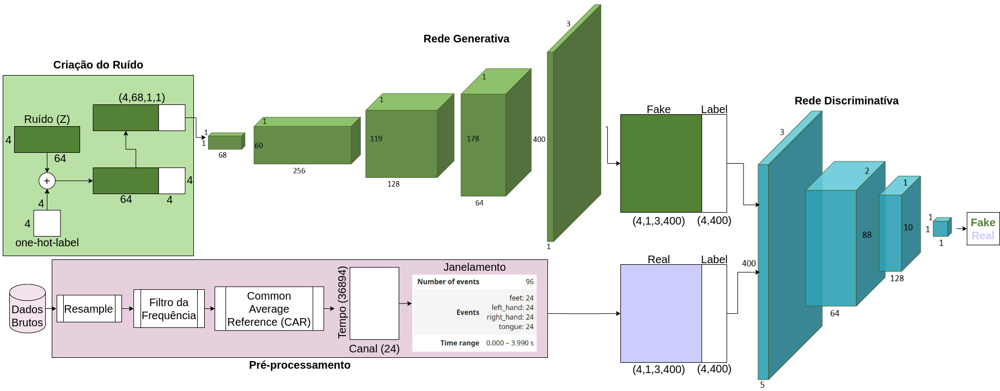

# Estudo de Caso: Síntese de Dados de EEG utilizando Redes Generativas Adversárias
# Case Study: EEG Data Synthesis through Generative Adversarial Networks

## Apresentação

O presente projeto foi originado no contexto das atividades da disciplina de pós-graduação *IA376L - Deep Learning aplicado a Síntese de Sinais*, 
oferecida no segundo semestre de 2023, na Unicamp, sob supervisão da Profa. Dra. Paula Dornhofer Paro Costa, do Departamento de Engenharia de Computação e Automação (DCA) da Faculdade de Engenharia Elétrica e de Computação (FEEC).

|Nome  | RA | Especialização|
|--|--|--|
| Joany Rodrigues  | 264440  | Eng. de Computação|
| João Guilherme Prado Barbon  | 262760  | Eng. Físico|
| Larissa Rangel de Azevedo  | 247008  | Eng. Eletricista|

## Descrição Resumida do Projeto
<!-- Este projeto tem como objetivo sintetizar dados de eletroencefalografia (EEG) gerados por uma interface cérebro-computador (BCI) utilizando o paradigma de imagética motora. A principal motivação da implementação de uma BCI é o estudo e a compreensão do cérebro, abrindo portas para aplicações na área da saúde e entretenimento. A abordagem do paradigma da imagética motora ocorre pela aquisição dos sinais cerebrais gerados pela imaginação ou realização do movimento de partes do corpo, como membros superiores (braços) ou inferiores (pernas). Assim, os dados sintéticos serão gerados a partir de uma Rede Generativa Adversária (GAN), que apresentará como saída séries temporais representativas dos sinais reais de EEG.  
 -->
Este projeto tem como objetivo sintetizar dados de eletroencefalografia (EEG) gerados por uma interface cérebro-computador (BCI, do inglês Brain-Computer Interface) utilizando o paradigma de imagética motora. Esse sistema apresenta um vasto potencial para aplicações inovadoras, com benefícios notáveis, sobretudo considerando a população que enfrenta diversos tipos de deficiências (sejam elas visuais, auditivas, motoras ou cognitivas), bem como o crescente mercado das tecnologias assistivas e interativas. A principal motivação subjacente à implementação das BCIs é o estudo e a compreensão do funcionamento cerebral, abrindo caminhos para aplicações nos campos da saúde e entretenimento. 

Uma abordagem notável dentro desse contexto é a utilização do paradigma de imagética motora, que envolve a aquisição de sinais cerebrais gerados pela imaginação ou execução de movimentos de partes do corpo, como membros superiores (braços) e inferiores (pernas). Buscando a melhor reprodutibilidades desses sinais de EEG, a geração de dados sintéticos será realizada por meio de uma Rede Generativa Adversária (GAN), que produzirá séries temporais dos sinais de EEG reais. Tal abordagem oferece a capacidade de criar conjuntos de dados EEG diversificados e representativos, que podem ser usados para desenvolver e aprimorar sistemas BCI, tornando-os mais precisos e eficazes e abrangendo uma ampla variedade de cenários e condições. 

[Vídeo da Apresentação - 1ª entrega ](https://drive.google.com/file/d/1T1XJYjW1v4Qm5PvELuSoJu00xOpP94OW/view)

## Metodologia Proposta
- A base de dados que será utilizada é a [BNCI2014_001](https://moabb.neurotechx.com/docs/generated/moabb.datasets.BNCI2014_001.html#r55ebd47d0fe7-1), que consiste em dados de EEG de nove indivíduos, com quatro classes de movimento diferentes: movimento da mão esquerda (classe 1), da mão direita (classe 2), de ambos os pés (classe 3) e da lingua (classe 4). Este dataset foi utilizado no Review BCI Competition 4, sendo portanto bem documentado e testado.
- Como principal modelo generativo, serão utilizadas GANs para geração dos dados sintéticos. Como primeira abordagem, propomos uma DCGAN conforme o artigo [EEG-GAN](https://arxiv.org/abs/1806.01875).
- Outro artigo de referência utilizado analisa o impacto do aumento de dados sintéticos de EEG na avaliação de classificadores - [Augmenting EEG with Generative Adversarial Networks Enhances Brain Decoding Across Classifiers and Sample Sizes](https://escholarship.org/uc/item/9gz8g908)
-  As ferramentas utilizadas serão:
    - Linguagem:  Python
    - Biblioteca: Pythorch
    - Ambiente: Google Colab e Kaggle
  
- Os resultados esperados serão distribuições de dados sintéticos de EEG que melhor se aproximam das distribuições reais. Para verificar se as distribuições são compatíveis, iremos mapear os dados para um manifold de menor dimensão utilizando técnicas como autoencoders, PCA ou tSNE. Como métrica de avaliação, serão utilizadas técnicas como distância Euclidiana, as divergências de Kullback-leibler e Jensen–Shannon e por fim uma análise comparativa de classificadores alimentados com dados sintéticos e dados reais.

### Bases de Dados e Evolução

|Base de Dados | Endereço na Web | Resumo descritivo|
|----- | ----- | -----|
|BNCI2014_001| https://encurtador.com.br/lpsAK| Dados de EEG de 9 indivíduos, adquiridos por meio 22 eletrodos dispostos no escalpo de cada indivíduo, durante o experimento de realização de 4 movimentos diferentes. 

> Faça uma descrição sobre o que concluiu sobre esta base. Sugere-se que respondam perguntas ou forneçam informações indicadas a seguir:
>
> 
> * Qual o formato dessa base, tamanho, tipo de anotação? 

 A base de dados utilizada estava em um formato "braindecode.datasets.moabb.MOABBDataset", que é o formato padrão da toolboox Braindecode, disponível em Python.  O [Braindecode](https://braindecode.org/stable/index.html) é uma fonte de dados abertos que contém informações sobre os sinais eletrofisiológicos do cérebro humano que podem ser usados em modelos de aprendizado profundo de máquina. 

> * Quais as transformações e tratamentos feitos? Limpeza, reanotação, etc.

As transformações foram feitas usando a biblioteca 'braindecode.preprocessing.Preprocessor', que  aplica a função de pré-processamento fornecida aos dados brutos. 

A primeira transformação realizada foi a mudança de escala dos dados, que estavam em Volts (V) para microVolts (uV). Em seguida foi feito uma reamostragem para 100 Hz e uma filtragem utilizando um filtro passa-faixa com frequências de corte de 4 e 38 Hz, para eliminar frequências irrelevantes, por exemplo  60 Hz oriunda da rede elétrica. Além disso, foi utilizado um filtro CAR - [Common Average Reference](https://pressrelease.brainproducts.com/referencing/#:~:text=When%20applying%20the%20so%2Dcalled,resulting%20signal%20from%20each%20channel.) - para remover os ruídos internos e externos da aquisição. 

Por último, foi feito o janelamento dos dados em janelas de  4s (400 amostras) para dividir os dados entre as 4 classes, mas também para reduzir a quantidade de amostras  processadas pelo o algoritmo, reduzindo também o tempo de processamento.

Dentre os 22 eletrodos, foram selecionados apenas  
os 'C3', 'Cz', 'C4', pois estes estão localizados na região do córtex motor do cérebro, aonde os sinais cerebrais referentes á movimentação são mais evidentes. 

> * Inclua um sumário com estatísticas descritivas da(s) base(s) de estudo.

A tabela a seguir mostra as estatísticas descritivas da base de estudo, em que Q1 e Q3 são os quartis.  

| ch  | name  | type | unit | min           | Q1          | median  | Q3          | max          |
|----:|-------|------|------|--------------:|------------:|--------:|------------:|------------:|
|   0 | Fz    | EEG  | µV   | -23197412.26  | -2764233.74 | -59893.33 | 2689774.31  | 24117502.14 |
|   1 | FC3   | EEG  | µV   | -16092798.07  | -2262880.58 |  9058.88 | 2221504.87  | 16416656.78 |
|   2 | FC1   | EEG  | µV   | -19583299.93  | -2197222.31 | -3899.04 | 2155626.09  | 16767533.19 |
|   3 | FCz   | EEG  | µV   | -20189703.99  | -2348475.26 | -34185.20 | 2288364.73  | 17884609.01 |
|   4 | FC2   | EEG  | µV   | -16651394.00  | -2096426.26 | -17829.59 | 2072305.99  | 17704307.52 |
|   5 | FC4   | EEG  | µV   | -17091787.21  | -2257461.58 | -16192.81 | 2252035.06  | 17556741.76 |
|   6 | C5    | EEG  | µV   | -16363957.84  | -2464807.19 |  28147.23 | 2456031.64  | 21078452.11 |
|   7 | C3    | EEG  | µV   | -21211591.44  | -1746918.71 |  33566.48 | 1796777.18  | 21687721.12 |
|   8 | C1    | EEG  | µV   | -23428939.98  | -1387423.47 |  11196.68 | 1404395.06  | 30463036.86 |
|   9 | Cz    | EEG  | µV   | -14918655.42  | -1643685.54 |  -6336.32 | 1638304.56  | 14533799.88 |
|  10 | C2    | EEG  | µV   | -10423506.98  | -1388777.30 |   3095.53 | 1406398.20  | 10402446.50 |
|  11 | C4    | EEG  | µV   | -17684305.36  | -1813621.59 |  17419.43 | 1840669.03  | 12688415.45 |
|  12 | C6    | EEG  | µV   | -21559642.80  | -2631099.24 | -12882.52 | 2641556.70  | 23328653.66 |
|  13 | CP3   | EEG  | µV   | -17972880.92  | -2152442.25 | 61684.71 | 2240892.25  | 15908321.92 |
|  14 | CP1   | EEG  | µV   | -14620068.46  | -1444056.81 | 37891.09 | 1482102.75  | 18123839.36 |
|  15 | CPz   | EEG  | µV   | -13303892.60  | -1416615.66 |   762.69 | 1422849.62  | 12948253.60 |
|  16 | CP2   | EEG  | µV   | -11823591.95  | -1329206.34 | 16067.51 | 1362674.56  | 10213997.18 |
|  17 | CP4   | EEG  | µV   | -25137329.68  | -2018397.32 | 34057.89 | 2061892.99  | 16786867.70 |
|  18 | P1    | EEG  | µV   | -19384165.37  | -2311265.52 | 55445.33 | 2338381.92  | 19757396.00 |
|  19 | Pz    | EEG  | µV   | -24524615.78  | -2097203.73 | 20822.05 | 2128965.70  | 15253330.64 |
|  20 | P2    | EEG  | µV   | -30192611.43  | -2272931.93 |   255.07 | 2316270.46  | 18435264.58 |
|  21 | POz   | EEG  | µV   | -36473536.55  | -3385989.48 | -12468.79 | 3385965.87  | 29828793.42 |

> * Utilize tabelas e/ou gráficos que descrevam os aspectos principais da base que são relevantes para o projeto.

As informações relevantes da base de dados usadas para o projeto foram: 
(colocar o plot do sinal dos 3 eletrodos)
Informações  | Descrição
--------- | ------
Eletrodos | 'C3', 'Cz', 'C4'
Janelas | Nº de Janleas: 96, Janelas/classe: 24

## Workflow

 Figura 01 - linha de base da proposta de geração de dados sintéticos: A rede generativa contém 4 camadas convoluvionais que recebem como entrada ruído de dimensão (4,68,1,1) e retorna dados sintéticos de dimensão (4,1,3,400), o discriminador tem duas camadas convolucionais classifica dados reais e gerados pela rede generatica.

### Criação de ruído
O ruído para o treinamento do gerador foi criado usando xxxx. Além do ruído representando o sinal EEG (4,64), também é criado a label para este sinal (4,4). Para obter a label do respectivo ruído é feito a contatenação, tornando a entrada do gerador (68,4) e por fim, uma conversão para transformar o sinal EEG (4,68,1,1). Este é o sinal ruído passado para o treinamento do gerador.

### Rede generativa
A rede generativa possui 4 camadas convolucionais, que recebe o sinal ruído e gera um sinal EEG de (4,1,3,400). As operações utilizados para obter a saída adequada foram stride e pooling. 

### Rede discriminativa
A rede discriminativa recebe como entrada um sinal EEG para o classificar em real ou fake. Note que este rede recebe como entrada o sinal real ou o sinal fake. Esta rede possui 2 camada convolucionais que realiza operações para obter uma saída (1,1).

### Configuração de treinamento da GAN

## Métricas de avaliação
### Classificador
Implementamos um [cassificador](https://github.com/jbarbon/dgm-2023.2/tree/main/projetos/EEG_Data_Synth/notebooks/GANs/JS_metric.ipynb) para classificar as classes dos dados reais e dados sintéticos. A estrutura e parametros do classificador é mostrada na tabela abaixo.

| camada   |tipo de camada | tamanho do kernel | Stride| padding|
|:--------:|:-------------:|:-----------------:|:-----:|:------:| 
|  conv1   | Conv2d        |(1, 400)           |(1, 1) |-
|batchnorm1|BatchNorm2d    | -                 | -     | -
| tconv2d1 |ConvTranspose2d|(118, 1)           | (1, 1)| -
| padding1 | ZeroPad2d     | -                 | -     |-
|  conv2   | Conv2d        |(2, 2)             |(1, 1) |-
|batchnorm2|BatchNorm2d    | -                 | -     | -
| pooling2 | MaxPool2d     |2                  | 1     |0
| padding2 | ZeroPad2d     |-                  | -     |-
|  conv3   | Conv2d        |(8, 4)             |(1, 1) |-
|batchnorm3|BatchNorm2d    | -                 | -     | -
| pooling3 | MaxPool2d     |2                  | 1     |0
| fc1      | -             |-                  | -     |-

### Divergencia de Jensen Shannon (JS)
A divergencia de Jensen Shannon é uma métrica que mede o quanto duas distribuições divergem entre si. É baseado na divergência de Kullback-Leibler, mas é simétrica. Utilizamos a biblioteca scipy para sua [implementação](https://github.com/jbarbon/dgm-2023.2/tree/main/projetos/EEG_Data_Synth/notebooks/GANs/JS_metric.ipynb).

# Resultados Preliminares

## Classificador
Utilizamos o classificador da seguinte forma: treinamento apenas dos dados reias; treinamento utilizando os dados reais e dados sintéticos. A tabela abaixo resume os resultados obtidos.

| Dados    |Learning rate | batch_size | Acurácia| 
|:--------:|:------------:|:----------:|:-------:|
| Reais    | 1e-05        |16          |0.448    |
|          |1e-05         |64          |0.448    | 
|          |1e-05         |256         |0.402    | 
|          |0.0001        | 16         |0.483    |
|          |0.0001        |64          |0.454    |
|          |0.0001        |256         |0.48     |
|          |0.001         |16          |0.471    |
|          |0.001         |64          |0.46     |
|          | 0.001        |256         |0.451    |
| Reais e fake   | 1e-05        |16          |0.337    |
|                |1e-05         |64          |0.327    | 
|                |1e-05         |256         |0.301    | 
|                |0.0001        | 16         |0.325    |
|                |0.0001        |64          |0.344    |
|                |0.0001        |256         |0.337     |
|                |0.001         |16          |0.334    |
|                |0.001         |64          |0.342     |
|                | 0.001        |256         |0.382    |

## Métrica JS
Foi calculada a divergencia de JS entre o dados reais e gerados pela rede generativa. A comparação foi feita para cada classe: pé, mão esqueda, mão direita e língua e para cada canal: C1, Cz e C4. O conjunto de dados reais possui 288 dados de cada classe e para cada canal, logo para o calculo desta métrica, foi gerada a mesma quantidade de dados, permitindo o calculo. Observe que os resultados foram bons, o que não era espqerado, pois nosso modelo não apresentou bons resultados durante o treinamento. Esses resultados mostram grande semelhança entre os dados reais e os gerados pelo rede uma vez que estão mais proximo de 0. Note que para cada canal os resultados da label são bastante semelhantes entre as classes. 

|                       |        |         |**Label**|       |
|:---------------------:|:------:|:-------:|:-----:|:-------:|
|  **Canal**            | feet   |left hand|right hand|tongue|
|   C1                  | 0.200  | 0.199   | 0.197 | 0.200  | 
| Cz                    | 0.024  | 0.025  | 0.024 |  0.027  | 
| C4                    | 0.218  | 0.217   | 0.216 | 0.218  |

## Experimentos, Resultados e Discussão dos Resultados

> Na entrega parcial do projeto (E2), essa seção pode conter resultados parciais, explorações de implementações realizadas e 
> discussões sobre tais experimentos, incluindo decisões de mudança de trajetória ou descrição de novos experimentos, como resultado dessas explorações.

> Na entrega final do projeto (E3), essa seção deverá elencar os **principais** resultados obtidos (não necessariamente todos), que melhor representam o cumprimento
> dos objetivos do projeto.

> A discussão dos resultados pode ser realizada em seção separada ou integrada à seção de resultados. Isso é uma questão de estilo.
> Considera-se fundamental que a apresentação de resultados não sirva como um tratado que tem como único objetivo mostrar que "se trabalhou muito".
> O que se espera da seção de resultados é que ela **apresente e discuta** somente os resultados mais **relevantes**, que mostre os **potenciais e/ou limitações** da metodologia, que destaquem aspectos
> de **performance** e que contenha conteúdo que possa ser classificado como **compartilhamento organizado, didático e reprodutível de conhecimento relevante para a comunidade**. 

## Cronograma
> Proposta de cronograma.

|                                       | Setembro     |             | Outubro     |             | Novembro    |             |
|:-------------------------------------:|:------------:|:-----------:|:-----------:|:-----------:|:-----------:|:-----------:|
| **Atividades**                            | 1ª quinzena  | 2ª quinzena | 1ª quinzena | 2ª quinzena | 1ª quinzena | 2ª quinzena |
| **Primeira Entrega**                    | ✔            |             |             |             |             |             |
| Definição do tema                     | ✔            |             |             |             |             |             |
| Levantamento bibliográfico            | ✔            |             |             |             |             |             |
| Escolha da base de dados              |✔            |             |             |             |             |             |
| Escrita da proposta de projeto        | ✔            |             |             |             |             |             |
| **Segunda Entrega**                   |              |             |             |             |             |             |
| Pré-processamento dos dados           |              | X           |             |             |             |             |
| Levantamento bibliográfico           |              | X           |             |             |             |             |
| Reprodução dos resultados do artigo   |              |             | X           | X           |             |             |
| Avaliação dos resultados preliminares |              |             |             | X           |             |             |
| **Entrega Final**                         |              |             |             |             |             |             |
| Consolidação da síntese dos dados     |              |             |             |             | X           |             |
| Resultado das métricas de avaliação   |              |             |             |             | X           | X           |
| Escrita final do projeto              |              |             |             |             |             | X           |

## Conclusão

> A seção de Conclusão deve ser uma seção que recupera as principais informações já apresentadas no relatório e que aponta para trabalhos futuros.
> Na entrega parcial do projeto (E2) pode conter informações sobre quais etapas ou como o projeto será conduzido até a sua finalização.
> Na entrega final do projeto (E3) espera-se que a conclusão elenque, dentre outros aspectos, possibilidades de continuidade do projeto.

## Referências Bibliográficas
- Tese Sarah Negreiros de Carvalho Leite - Contribuições ao desenvolvimento de interfaces cérebro-computador baseadas em potenciais evocados visualmente em regime estacionário

Tese: (https://doi.org/10.47749/T/UNICAMP.2016.970748)

- Augmenting EEG with Generative Adversarial Networks Enhances Brain Decoding Across Classifiers and Sample Sizes

Paper: (https://escholarship.org/uc/item/9gz8g908)
Git: (https://github.com/AutoResearch/EEG-GAN)

- EEG data augmentation for emotion recognition with a multiple generator conditional Wasserstein GAN

Paper: (https://link.springer.com/article/10.1007/s40747-021-00336-7)

- EEG-GAN: Generative adversarial networks for electroencephalograhic (EEG) brain signals

Paper: (https://arxiv.org/abs/1806.01875)
Git: (https://github.com/aung2phyowai/GAN)

