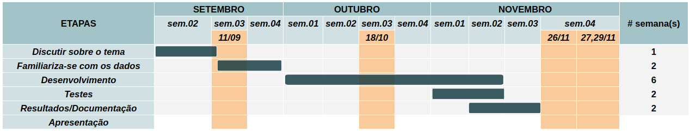

# `EEGen: Geração de Dados de EEG para BCI`
# `EEGen: EEG Synthetic Data Generation for BCI`

## Apresentação

O presente projeto foi originado no contexto das atividades da disciplina de pós-graduação IA376L - Deep Learning aplicado à Síntese de Sinais, oferecida no segundo semestre de 2023, na Unicamp, sob supervisão da Profa. Dra. Paula Dornhofer Paro Costa, do Departamento de Engenharia de Computação e Automação (DCA) da Faculdade de Engenharia Elétrica e de Computação (FEEC).

> |Nome  | RA | Especialização|
> |--|--|--|
> | Alexandre Herrero Matias  | 223665  | Eng. de Computação|
> | Maria Julia De Castro Villafranca Garcia | 183575  | Eng. Eletricista|

## Resumo (Abstract)
<!--
> Descrição do tema do projeto, incluindo contexto gerador, motivação.
> Descrição do objetivo principal do projeto.
> Esclarecer qual será a saída do modelo generativo.
> Incluir nessa seção link para vídeo de apresentação da proposta do projeto (máximo 5 minutos).
-->

Uma Interface Cérebro-Computador (BCI) é um sistema que permite identificar padrões cerebrais estáveis de indivíduos durante a execução de determinadas tarefas mentais. Uma vez identificados é possível utilizá-los para diversas tarefas como controlar outros sistemas ou máquinas. Medir a atividade cerebral de forma eficaz é o primeiro passo crítico em um sistema de BCI. Existem técnicas de gravação invasivas e não invasivas, que permitem monitorar a atividade elétrica do cérebro ao longo do tempo e em diferentes áreas cerebrais.

A Eletroencefalografia é um método não invasivo que nos permite monitorar a atividade elétrica do cérebro. O registro gerado pela eletroencefalografia é o eletroencefalograma (EEG), que mede, principalmente, a soma dos potenciais pós-sinápticos gerados por milhares de neurônios com a mesma orientação radial em relação a seu escalpo. Os sinais são medidos em microvolts possuindo como frequência, principalmente, Delta, Theta, Alpha ou Beta, como exemplificado abaixo.

Junto de técnicas de inteligência artificial, a aplicabilidade de tais dados é vasta. Dentro do âmbito tipo MI (*motor imagery*), tais dados de EEG permite com que pessoas com paralizia severa possam desenhar [[7]](#referências-bibliográficas), para tratar epilepsia [[8]](#referências-bibliográficas) e, também para jogos [[9]](#referências-bibliográficas) e uso de veículos [[10]](#referências-bibliográficas). 

## Descrição do Problema/Motivação
<!--
> Resumo do objetivo, metodologia e resultados obtidos (na entrega E2 é possível relatar resultados parciais). Sugere-se máximo de 100 palavras.
-->

Dados de eletroencefalograma, se enquadram como dados médicos, e, portanto, não são simples de se coletar e não são distribuídos em grandes quantidades. Especialmente quando se busca mecanismos específicos de extração de informação de atividade cerebral. Nesse sentido, nos propomos a desenvolver um sistema de geração de dados de eletroencefalograma com a ideia de realizar um Data Augmentation nestes dados e auxiliar nas pesquisas em BCI. Os dados gerados devem ser do modelo de extração de informação de atividade cerebral conhecido como imagética motora (*motor imagery*).

Uma apresentação em vídeo da proposta pode ser acessada [aqui](https://youtu.be/mS_asNZQ8po).

## Objetivo
<!--
> Descrição do que o projeto se propõe a fazer. É possível explicitar um objetivo geral e objetivos específicos do projeto.
-->

## Metodologia
<!--
> Descrever de maneira clara e objetiva, citando referências, a metodologia proposta para se alcançar os objetivos do projeto. Descrever bases de dados utilizadas. Citar algoritmos de referência. Justificar os porquês dos métodos escolhidos. Apontar ferramentas relevantes. Descrever metodologia de avaliação (como se avalia se os objetivos foram cumpridos ou não?).
-->

### Bases de Dados
<!--
> Elencar bases de dados utilizadas no projeto. Para cada base, coloque uma mini-tabela no modelo a seguir e depois detalhamento sobre como ela foi analisada/usada, conforme exemplo a seguir.
> Faça uma descrição sobre o que concluiu sobre esta base. Sugere-se que respondam perguntas ou forneçam informações indicadas a seguir:

> Qual o formato dessa base, tamanho, tipo de anotação?
> Quais as transformações e tratamentos feitos? Limpeza, reanotação, etc.
> Inclua um sumário com estatísticas descritivas da(s) base(s) de estudo.
> Utilize tabelas e/ou gráficos que descrevam os aspectos principais da base que são relevantes para o projeto.
-->

|**Base de Dados** | **Endereço na Web** | **Resumo descritivo**|
|----- | ----- | ------------------|
|BCI Competition IV 2a|http://bnci-horizon-2020.eu/database/data-sets | |

Utilizando como referência alguns artigos de geração de dados EEG ([[1]](#referências-bibliográficas)-[[3]](#referências-bibliográficas)), os conjuntos de dados utilizados variam, sendo similares, entretanto, em terem os sinais já estarem separados por classes - seja por emoção (SEED V, [[1]](#referências-bibliográficas)), por objeto (EEG-image, [[5]](#referências-bibliográficas)) ou do tipo *motor imagery* (MOABB, [[6]](#referências-bibliográficas)). 

Para o treinamento, inicialmente, escolheremos um ou mais conjuntos de dados do MOABB [[6]](#referências-bibliográficas), visto que este contém alguns dos dados mais utilizados na literatura para imagética motora, os dados da [BCI Competition IV](https://moabb.neurotechx.com/docs/generated/moabb.datasets.BNCI2014_001.html#moabb.datasets.BNCI2014_001).

### Workflow
<!--
> Use uma ferramenta que permita desenhar o workflow e salvá-lo como uma imagem (Draw.io, por exemplo). Insira a imagem nessa seção. Você pode optar por usar um gerenciador de workflow (Sacred, Pachyderm, etc) e nesse caso use o gerenciador para gerar uma figura para você. Lembre-se que o objetivo de desenhar o workflow é ajudar a quem quiser reproduzir seus experimentos.
-->
#### Ferramentas
À princípio, as ferramentas que serão utilizadas serão: 

- [Pytorch](https://pytorch.org/)
- Notebook interfaces ([GoogleColab](https://colab.google/), [JupyterLab](https://jupyter.org/))

### Experimentos, Resultados e Discussão dos Resultados
#### Experimentos
<!--
> Na entrega parcial do projeto (E2), essa seção pode conter resultados parciais, explorações de implementações realizadas e discussões sobre tais experimentos, incluindo decisões de mudança de trajetória ou descrição de novos experimentos, como resultado dessas explorações.
> Na entrega final do projeto (E3), essa seção deverá elencar os principais resultados obtidos (não necessariamente todos), que melhor representam o cumprimento dos objetivos do projeto.
> A discussão dos resultados pode ser realizada em seção separada ou integrada à seção de resultados. Isso é uma questão de estilo. Considera-se fundamental que a apresentação de resultados não sirva como um tratado que tem como único objetivo mostrar que "se trabalhou muito". O que se espera da seção de resultados é que ela apresente e discuta somente os resultados mais relevantes, que mostre os potenciais e/ou limitações da metodologia, que destaquem aspectos de performance e que contenha conteúdo que possa ser classificado como compartilhamento organizado, didático e reprodutível de conhecimento relevante para a comunidade.
-->

O projeto será feito, inicialmente, utilizando como modelo generativo os modelos de difusão, LSTM-VAE GAN e Transformers, seguindo a literatura de referência como ponto de partida para a implementação ([1], [2], [3]).

- [[1]](#referências-bibliográficas) Usou DDPM (*denoising diffusion probabilistic model*) para a geração de dados EEG, à partir de EFDMs (*electrode-frequency distribution*) do *dataset* SEED V rotulados com base somente nas emoções *sad* (triste) e *happy* (feliz).

- [[2]](#referências-bibliográficas) Trás um comparativo da geração de sinais de EEG através de 5 GANs com diferentes arquiteturas. O artigo trás a aplicação de métricas interessantes para a avaliação dos dados gerados frente aos dados originais.

- [[3]](#referências-bibliográficas) Usou uma conditional TTS-WGAN-GP (transformer-encoder-based generator and discriminator for time series - TTS) com a informação adicional de *input* (rótulos) sendo a condição das amostras de EEG; *win* ou *lose*, mais informação do *dataset* vide [[4]](#referências-bibliográficas).

Como resultado final, esperamos um modelo generativo capaz de gerar dados sintéticos de EEG (séries temporais), trazendo resultados práticos similares aos obtidos com os dados reais, porém se atendendo para uma pergunta pertinente na geração de dados sintéticos: "O modelos proposto está gerando novos dados ou simplemente replicando as amostras do dado original?" [[1]](#referências-bibliográficas).

#### Métricas
Para avaliar tais dados propõem-se, inicialmente, as seguintes métricas:

| Métrica | Referência |
| --- | --- |
| TSTR (*Train on Synthetic, Test on Real*) | [[3]](#referências-bibliográficas)  |
| TRTR (*Train on Real, Test on Real*) | [[3]](#referências-bibliográficas)  |
| Inception score (IS) | [[2]](#referências-bibliográficas)  |
| Frechet Inception Distance (FID) | [[2]](#referências-bibliográficas)  |
| Euclidean Distance (ED) | [[2]](#referências-bibliográficas)  |
| Sliced Wasserstein distance (S-WD) | [[2]](#referências-bibliográficas)  |
| Acurácia de classificação | [[1]](#referências-bibliográficas) |

Outras métricas, usadas para a análise de séries temporais síntetizadas por modelos de aprendizado profundo, como verifiado em [[11]](#referências-bibliográficas) se mostram interessantes também para a análise de dados de EEG sintetizados, por exemplo, a Maximum Mean Discrepancy (MMD), Dynamic Time Warping (DTW), Pearson Correlation Coefficient (PCC), Mean Absolute Error (MAE), Percentage Relative Difference (PRD) e Fractal Dimension (FD).

#### Resultados

## Conclusão
<!--
> A seção de Conclusão deve ser uma seção que recupera as principais informações já apresentadas no relatório e que aponta para trabalhos futuros. Na entrega parcial do projeto (E2) pode conter informações sobre quais etapas ou como o projeto será conduzido até a sua finalização. 
Na entrega final do projeto (E3) espera-se que a conclusão elenque, dentre outros aspectos, possibilidades de continuidade do projeto.
-->

## Cronograma
O cronograma proposto é uma estimativa temporal das principais etapas pelo projeto. Ademais, junto marcamos os *checkpoints* previstos para guiar e lembrar-nos das entregas e da geração das *release tags*.

## Referências Bibliográficas

[1] Tosato, G., Dalbagno, C. M., & Fumagalli, F. (2023). EEG Synthetic Data Generation Using Probabilistic Diffusion Models. arXiv preprint arXiv:2303.06068.

[2] Hartmann, K. G., Schirrmeister, R. T., & Ball, T. (2018). EEG-GAN: Generative adversarial networks for electroencephalographic (EEG) brain signals. arXiv preprint arXiv:1806.01875.

[3] Williams, C. C., Weinhardt, D., Wirzberger, M., & Musslick, S. (2023). Augmenting EEG with Generative Adversarial Networks Enhances Brain Decoding Across Classifiers and Sample Sizes. In Proceedings of the Annual Meeting of the Cognitive Science Society (Vol. 45, No. 45).

[4] Williams, C. C., Ferguson, T. D., Hassall, C. D., Abimbola, W., & Krigolson, O. E. (2021). The ERP, frequency, and time–frequency correlates of feedback processing: Insights from a large sample study. Psychophysiology, 58(2), e13722.

[5] Spampinato, C., Palazzo, S., Kavasidis, I., Giordano, D., Souly, N., & Shah, M. (2017). Deep learning human mind for automated visual classification. In Proceedings of the IEEE conference on computer vision and pattern recognition (pp. 6809-6817).

[6] Jayaram, V., & Barachant, A. (2018). MOABB: trustworthy algorithm benchmarking for BCIs. Journal of neural engineering, 15(6), 066011.

[7] Münßinger, J. I., Halder, S., Kleih, S. C., Furdea, A., Raco, V., Hösle, A., & Kübler, A. (2010). Brain painting: first evaluation of a new brain–computer interface application with ALS-patients and healthy volunteers. Frontiers in neuroscience, 4, 182.

[8] Gadhoumi, K., Lina, J. M., Mormann, F., & Gotman, J. (2016). Seizure prediction for therapeutic devices: A review. Journal of neuroscience methods, 260, 270-282.

[9] Marshall, D., Coyle, D., Wilson, S., & Callaghan, M. (2013). Games, gameplay, and BCI: the state of the art. IEEE Transactions on Computational Intelligence and AI in Games, 5(2), 82-99.

[10] Zhuang, J., & Yin, G. (2017, July). Motion control of a four-wheel-independent-drive electric vehicle by motor imagery EEG based BCI system. In 2017 36th Chinese Control Conference (CCC) (pp. 5449-5454). IEEE.

[11] Brophy, E., Wang, Z., She, Q., & Ward, T. (2023). Generative adversarial networks in time series: A systematic literature review. ACM Computing Surveys, 55(10), 1-31.
