

# `EEGen: Geração de Dados de EEG para BCI`
# `EEGen: EEG Synthetic Data Generation for BCI`

## 1. Apresentação

O presente projeto foi originado no contexto das atividades da disciplina de pós-graduação IA376L - Deep Learning aplicado à Síntese de Sinais, oferecida no segundo semestre de 2023, na Unicamp, sob supervisão da Profa. Dra. Paula Dornhofer Paro Costa, do Departamento de Engenharia de Computação e Automação (DCA) da Faculdade de Engenharia Elétrica e de Computação (FEEC).

> |Nome  | RA | Especialização|
> |--|--|--|
> | Alexandre Herrero Matias  | 223665  | Eng. de Computação|
> | Maria Julia De Castro Villafranca Garcia | 183575  | Eng. Eletricista|

## 2. Resumo (Abstract)
<!--
The current project originated within the framework of the activities of the postgraduate course IA376L - Deep Learning Applied to Signal Synthesis, offered in the second semester of 2023 at Unicamp, under the supervision of Professor Dr. Paula Dornhofer Paro Costa from the Department of Computer Engineering and Automation (DCA) at the School of Electrical and Computer Engineering (FEEC).
> Descrição do tema do projeto, incluindo contexto gerador, motivação.
> Descrição do objetivo principal do projeto.
> Esclarecer qual será a saída do modelo generativo.
> Incluir nessa seção link para vídeo de apresentação da proposta do projeto (máximo 5 minutos).
> Resumo do objetivo, metodologia e resultados obtidos (na entrega E2 é possível relatar resultados parciais). Sugere-se máximo de 100 palavras.
-->

Uma Interface Cérebro-Computador (BCI) é um sistema que permite identificar padrões cerebrais estáveis de indivíduos durante a execução de determinadas tarefas mentais. Uma vez identificados, é possível utilizá-los para diversas tarefas como controlar outros sistemas ou máquinas. 

Existem técnicas de gravação invasivas e não invasivas, que permitem monitorar a atividade elétrica do cérebro ao longo do tempo e em diferentes áreas cerebrais. Independente da técnica, a medição eficaz da atividade cerebral é o primeiro passo crítico em um sistema de BCI.

Um dos métodos não invasivos que nos permite monitorar a atividade elétrica do cérebro é a eletroencefalografia. O registro gerado pela eletroencefalografia é o eletroencefalograma (EEG), que mede, principalmente, a soma dos potenciais pós-sinápticos gerados por milhares de neurônios com a mesma orientação radial em relação a seu escalpo. Os sinais são medidos em microvolts e possuem como compoenentes de frequência, principalmente, Delta, Theta, Alpha e Beta, como exemplificado na figura abaixo retirada de [[13]](https://www.medicine.mcgill.ca/physio/vlab/biomed_signals/eeg_n.htm).

## 3. Descrição do Problema/Motivação
<!--
> Descrição do contexto gerador do tema do projeto. Motivação para abordar este tema de projeto.
-->
A principal motivação do presente projeto é estudar métodos de aprendizado profundo para a geração de dados de MI-EEG. A rusga que incentiva tal estudo se baseia no fato de que junto do avanço do desenvolvimento de técnicas de inteligência artificial, a aplicabilidade de dados EEG se tornou mais proeminente e interessante (à exemplo, *the thoughts to image of the* [DreamDiffusion](https://arxiv.org/pdf/2306.16934.pdf)), e, com redes mais profundas e complexas a necessidade de uma quantidade de dados requeridos maior, aumenta. 

A escolha pelo tipo de dado (*motor-imagery or MI-EEG*) ocorre em razão de sua aplicação que é extremamente ampla, se estendendo desde do auxílio de pessoas com paralisia severa a desenhar [[7]](https://www.frontiersin.org/articles/10.3389/fnins.2010.00182/full), a trantamento de epilepsia [[8]](https://www.sciencedirect.com/science/article/abs/pii/S0165027015002277), melhoria da experiência em jogos [[9]](https://ieeexplore.ieee.org/abstract/document/6518141) e uso na condução de veículos [[10]](https://www.mdpi.com/2079-9292/11/19/3171). 

## 4. Objetivo
<!--
> Descrição do que o projeto se propõe a fazer. É possível explicitar um objetivo geral e objetivos específicos do projeto.
-->

Dados de eletroencefalograma, se enquadram como dados médicos, e, portanto, não são simples de se coletar e não são distribuídos em grandes quantidades. Especialmente quando se busca mecanismos específicos de extração de informação de atividade cerebral. Nesse sentido, nos propomos a estudar métodos de aprendizado profundo de geração de dados de eletroencefalograma com a ideia de tais dados auxiliar nas pesquisas em BCI. Os dados gerados devem ser do modelo de extração de informação de atividade cerebral conhecido como imagética motora (*motor-imagery or MI-EEG*).

Os slides-report do projeto (E2, E3) podem ser acessados [aqui](https://docs.google.com/presentation/d/1mkRYWdrhwL639Hv0Ji1hCzxZK0cqpVSVj9PF9gzU1TM/edit?usp=sharing). 

Uma apresentação em vídeo da proposta (E1) pode ser acessada [aqui](https://youtu.be/mS_asNZQ8po).

## 5. Metodologia
<!--
> Descrever de maneira clara e objetiva, citando referências, a metodologia proposta para se alcançar os objetivos do projeto. Descrever bases de dados utilizadas. Citar algoritmos de referência. Justificar os porquês dos métodos escolhidos. Apontar ferramentas relevantes. Descrever metodologia de avaliação (como se avalia se os objetivos foram cumpridos ou não?).
-->

### 5.1. Workflow e Códigos
<!--
> Use uma ferramenta que permita desenhar o workflow e salvá-lo como uma imagem (Draw.io, por exemplo). Insira a imagem nessa seção. Você pode optar por usar um gerenciador de workflow (Sacred, Pachyderm, etc) e nesse caso use o gerenciador para gerar uma figura para você. Lembre-se que o objetivo de desenhar o workflow é ajudar a quem quiser reproduzir seus experimentos.
-->

O workflow geral pode ser observado na figura abaixo. Em um primeiro momento (E2) o objetivo era familiarizar-se com os dados e montar uma *pipeline* para que o *plug-and-play* de diversos modelos pudesse ser feito, conforme observado no esquemático. A montagem do *workflow* foi fortemente baseada nos passos descritos por [[14]](https://link.springer.com/article/10.1007/s00521-021-06352-5).

Todo o *workflow* será quebrado nas sessões seguintes, mas de modo resumido, o  inicia com o processamento dos dados MI-EEG onde cada um dos 22 canais tem seus valores filtrados dentro do intervalo de 4-38Hz. Em seguida escalonamos esses valores de mV para V e efetuamos o janelamento dos dados. Por fim, antes dos dados serem usados nos modelos, eles passaram por uma normalização (*standardization*).

Depois, buscou-se explorar dentro da literatura inspirações para modelos que pudessem ser estudados para a geração de dados de MI-EEG. Dentro os escolhidos temos a DCGAN, a CNN-VAE, e a cLSTM-GAN. A justiticativa da escolha de tais arquiteturas será explicada em detalhes na sessão Modelos. 

Além disso, como observa-se no *workflow* a avaliação dos dados gerados basea-se fortemente na escolha do classificador.
Ao familiarizarmos com a biblioteca Braindecode, decidimos obter de lá um classificador para ajudar na avaliação dos dados gerados. O classificador que escolhemos é o EEGNetv4, pois é um dos classificadores que vimos sendo usado nos artigos [[1]](https://arxiv.org/pdf/2303.06068.pdf) e [[2]](https://arxiv.org/pdf/1806.01875.pdf). Ademais, a ideia é ter os dados gerados avaliados através da acurácia do classificador mencionado, como também através da Euclidean Distance implementada, TSTR (Train on Synthetic, Test on Real) e TRTS (Train on Real, Test on Synthetic) ([[2]](https://arxiv.org/pdf/1806.01875.pdf)).

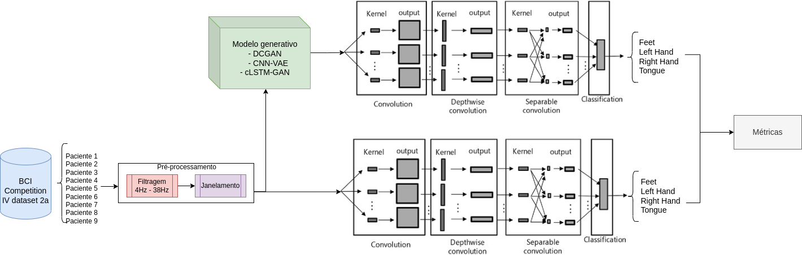

#### 5.1.1 Tools

As ferramentas que foram utilizadas são: 

- [Pytorch](https://pytorch.org/)
- Notebook interfaces ([GoogleColab](https://colab.google/), [JupyterLab](https://jupyter.org/))

#### 5.1.2 Environment Set Up (caso opte por rodar em sua máquina)

Um passo-a-passo para fazer o set up do enviroment usando conda (miniconda, [here](https://docs.conda.io/projects/miniconda/en/latest/)) para esse projeto seria: 

- `conda create -n eeg python=3.9` 
- `conda activate eeg` 
- `pip install -r base_requirements.txt` 

E como Pytorch requirements, usamos (por curiosidade, ["The safest way to install CUDA and cuDNN is to use a conda environment"](https://jrkwon.com/2022/11/22/cuda-and-cudnn-inside-a-conda-env/#:~:text=The%20safest%20way%20to%20install,LD_LIBRARY_PATH%20needs%20to%20be%20used)):

- `conda install pytorch==1.12.1 torchvision==0.13.1 torchaudio==0.12.1 cudatoolkit=11.3 -c pytorch`

#### 5.1.3 Descrição dos arquivos

Como uma forma de consulta, segue um guia dos arquivos presentes neste repositório e também uma breve descrição do que tal *script* faz.

|||
|-----|-----|
|[Data_acquiring.ipynb](./notebooks/Data_acquiring.ipynb)|Processamento dos dados e separação por label|
|[Images.ipynb](./notebooks/Images.ipynb)|Geração de gráficos|
|[Gaussian_noise.ipynb](./notebooks/Gaussian_noise.ipynb)|Ruido Gaussiano para cojunto misto dos 9 pacientes|
|[Gaussian_noise_sub.ipynb](./notebooks/Gaussian_noise_sub.ipynb)|Ruido Gaussiano separado por paciente|
|[CNN_VAE.ipynb](./notebooks/CNN_VAE.ipynb)|CNN-VAE para cojunto misto dos 9 pacientes|
|[CNN_VAE_sub.ipynb](./notebooks/CNN_VAE_sub.ipynb)|CNN-VAE separado por paciente|
|[DCGAN.ipynb](./notebooks/DCGAN.ipynb)|DCGAN para cojunto misto dos 9 pacientes|
|[DCGAN_sub.ipynb](./notebooks/DCGAN_sub.ipynb)|DCGAN separado por paciente|
|[cLSTM_GAN.ipynb](./notebooks/cLSTM_GAN.ipynb)|cLSTM-GAN para cojunto misto dos 9 pacientes|
|[cLSTM_GAN_val.ipynb](./notebooks/cLSTM_GAN_val.ipynb)|Calculo de métricas para o modelo cLSTM-GAN|
|||

### 5.2 Data
<!--
> Elencar bases de dados utilizadas no projeto. Para cada base, coloque uma mini-tabela no modelo a seguir e depois detalhamento sobre como ela foi analisada/usada, conforme exemplo a seguir.
> Faça uma descrição sobre o que concluiu sobre esta base. Sugere-se que respondam perguntas ou forneçam informações indicadas a seguir:

> Qual o formato dessa base, tamanho, tipo de anotação?
> Quais as transformações e tratamentos feitos? Limpeza, reanotação, etc.
> Inclua um sumário com estatísticas descritivas da(s) base(s) de estudo.
> Utilize tabelas e/ou gráficos que descrevam os aspectos principais da base que são relevantes para o projeto.
-->

|**Database** | **Website** | **Descriptive Summary**|
|----- | ----- | ------------------|
|BCI Competition IV 2a/BNCI2014_001|http://bnci-horizon-2020.eu/database/data-sets |https://lampx.tugraz.at/~bci/database/001-2014/description.pdf|

Os dados foram obtidos através da biblioteca em Python chamada [Braindecode](https://braindecode.org/stable/index.html), que é construída sobre outras bibliotecas em Python, a [MOABB](https://neurotechx.github.io/moabb/) e o [MNE](https://mne.tools/stable/index.html). O site de referência é o site *source* direcionado pelo artigo ([[12]](https://www.frontiersin.org/articles/10.3389/fnins.2012.00055/full)).

Os dados são baixados em formato `.mat` e são acessados por `subject_id`, no total há 9 voluntários saudáveis. Cada voluntário participou em duas sessões conduzidas em dias diferentes. Cada sessão teve 6 *runs* separados por *breaks* e tinham por objetivo registrar os sinais à partir da imaginação de 1 dos 4 movimentos, a saber: imaginação de movimento da mão esquerda, mão direita, ambos os pés e língua. Dentro dessas sessões cada um dos 6 *runs* consistiu de 48 *trials*, 12 para cada uma das 4 classes. 

A figura abaixo exemplifica a organização do dataset obtido junto do uso da biblioteca [Braindecode](https://braindecode.org/stable/index.html). É possível notar as principais frequências, que compõem do sinal (Delta, Theta, Alpha ou Beta).

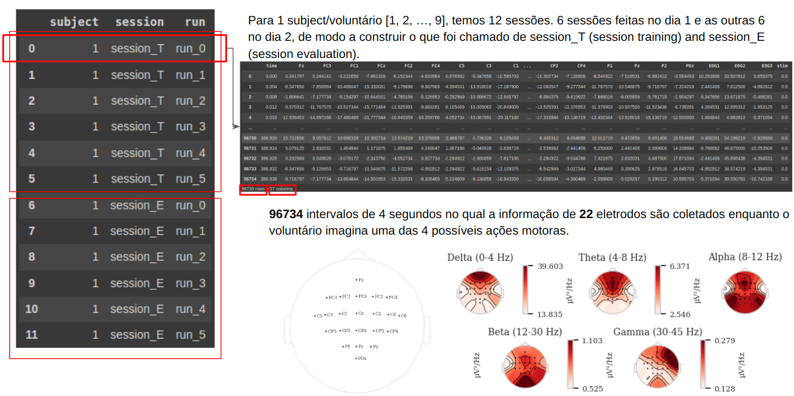

A figura abaixo contém um exemplo dos sinais coletados `subject_id=3`. Observa-se que entre a tarefa (onde há faixa colorida), houve *breaks* (indicado pelas faixas em branco). Observa-se também que para todos os movimentos o sinal de todos os canais foram recolhidos.

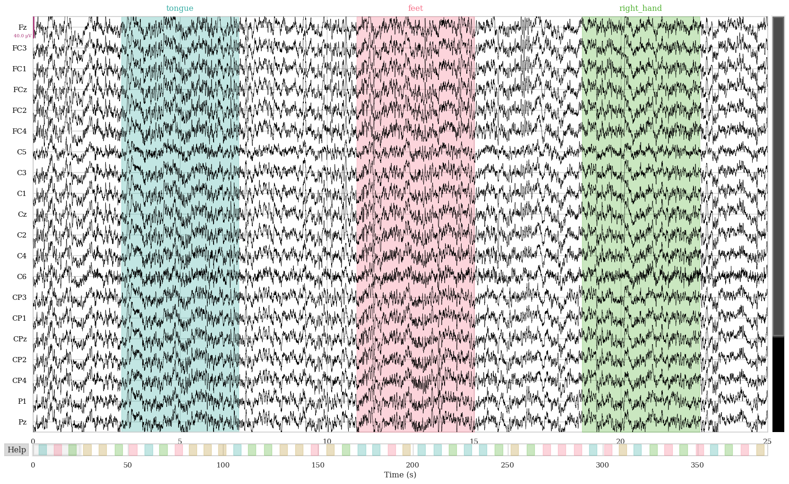

Para o treino dos modelos utilizamos os 9 voluntátios. Os dados foram pré-processados, seguindo o tutorial fornecido pelo Braindecode ([aqui](https://braindecode.org/stable/auto_examples/plot_dataset_example.html#sphx-glr-auto-examples-plot-dataset-example-py)), de modo a remover quaisquer canais que não fosse canais de EEG, com o posterior escalonamento dos dados e filtragem dentro do intervalo [4, 38]Hz. Tal sequência de processamento foi baseada na observação dos artigos ([[1]](#referências-bibliográficas)-[[3]](#referências-bibliográficas)). Com diferença de nós, nesse primeiro momento, ter escolhido manter todos os 22 canais dos dados. Dessa forma, após o processamento dos dados, tem-se a seguinte configuração para os dados de treinamento: `X.size = [576, 1, 22, 1125]` e `y.size = [576]`.

Em seguida, os dados foram usados para treinar 3 redes, a saber, uma CNN-VAE, uma DCGAN e uma cLSTM-GAN.

### 5.3 Modelos
Há uma diversidade de modelos aplicados na geração de dados de EEG. Na busca por inspiração para a escolha dos modelos consultamos não somente artigos de dados EEG do tipo *motor-imagery*, mas também do tipo *emotion-related*. Dentre os mais utilizados temos modelos híbridos de GAN, VAE e LSTM, (exemplos seria [VAE-GAN](https://ieeexplore.ieee.org/stamp/stamp.jsp?arnumber=10102265), [VAE-D2GAN](https://www.frontiersin.org/articles/10.3389/fncom.2021.723843/full), [MIEEG-GAN](https://ieeexplore.ieee.org/abstract/document/9206942?casa_token=nv7sPSqybwcAAAAA:9ELHSIKfrzZL_3u5I5P8r2CqzVsGwSagEWYB3QnonbtFKfUypaE44qKay_s2lxevFXAcP_OAcQ)) e modelos que empregram somente a GAN ([MI-EEG](https://ieeexplore.ieee.org/document/9206942), [EEG-GAN](https://arxiv.org/pdf/1806.01875.pdf)). 

Visto que a exploração de diferentes modelos é uma atividade que não somente nos permite notar particularidades dos dados, mas também, nos permite conhecer direntes metodologias, optou-se nesse projeto por explorar três arquiteturas diferentes, extrapolando para o *hands-on* a parte teórica discutida em aula.

#### 5.3.1 DCGAN
A arquitetura DCGAN é uma arquitetura muito comumento utilizada para a geração realística de imagens. Como observado na figura à baixo tal arquitetura contém camadas convolucionais transpostas e convencionais, construindo um *upsampling* e *downsmpling* gradual, mas curto, em cada rede da arquitetura.

A aplicação da DCGAN em séries temporais é promissor e comumente utilizada para a geração de dados de EEG. Isso ocorre, pois as camadas convolucionais são eficientes em capturar os padrões espaciais. No caso dos dados de EEG, referem-se aos padrões entre eletrodos assim como os padrões temporais. Havendo, para o caso da DCGAN, a aprendizagem de representações hierárquica dos padrões, portanto a captura de suas dependências. 

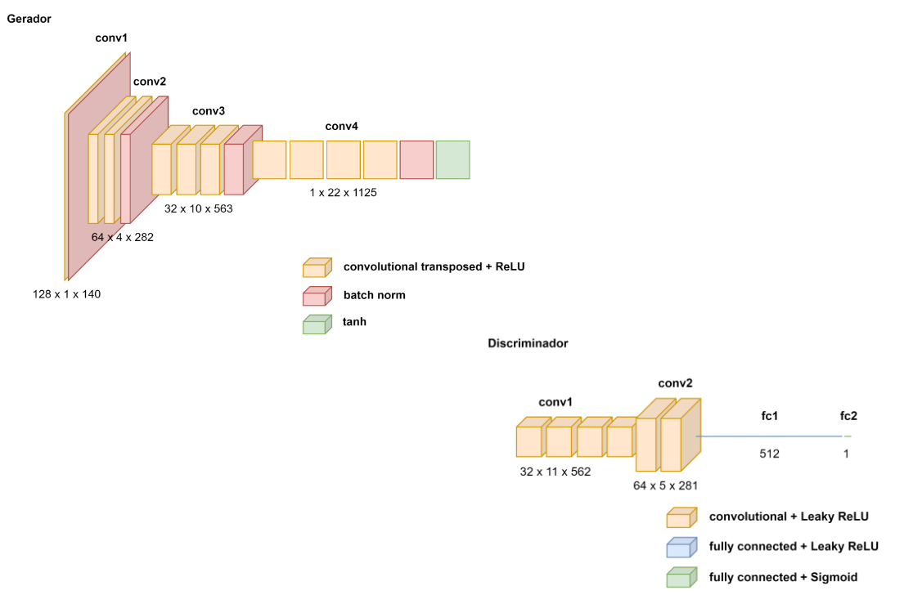

#### 5.3.2 CNN-VAE
A CNN-VAE possui a mesma característica de construção hierárquica de aprendizagem de padrões presente na DCGAN. A diferença que se buscou encontrar com essa arquitetura frente a DCGAN é uma maior estabilidade durante o treino, e portanto, melhores resultados.

Outra diferença da CNN-VAE em relação ao DCGAN é que a arquitetura da VAE com seu encoder-decoder e espaço latente permide com que o modelo aprenda a representação comprimida dos dados de entrada, o que é muito bem vindo para séries temporais, que muito comumente são carregadas de padrão temporais complexos.

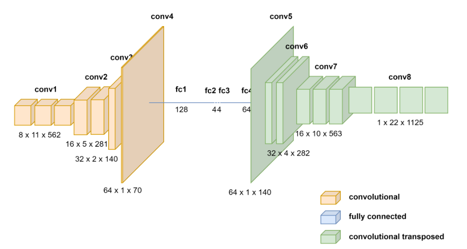

#### 5.3.2 cLSTM-GAN
A cLSTM-GAN é uma rede que combina LSTMs (*Long Short-Term Memory*) e GANs para a geração condicional dos dados. A principial diferenças entre as outras redes está na informação adicional que a classe contém e o fato do LSTM ser um tipo de rede neural recorrente (RNN) construída para lidar com dados sequênciais ao manter a memória de longas sequências.

A motivação do uso dessa rede está na possibilidade de geração de séries temporais mais realísticas um vez que padrões temporais mais sequências são capturadas.

#### 5.3.2 Métricas e Análises

As principais métricas utilizadas neste projeto são dependentes da acurácia de classificação dos dados de EEG. O classificador utilizado, bem conhecido na literatura, foi a EEGNet. EEGNet é um modelo de classificação convolucional que alcança uma taxa de acerto de, em média, 70% para dados de EEG de um mesmo indivíduo. 

 - Arquitetura da EEGNet

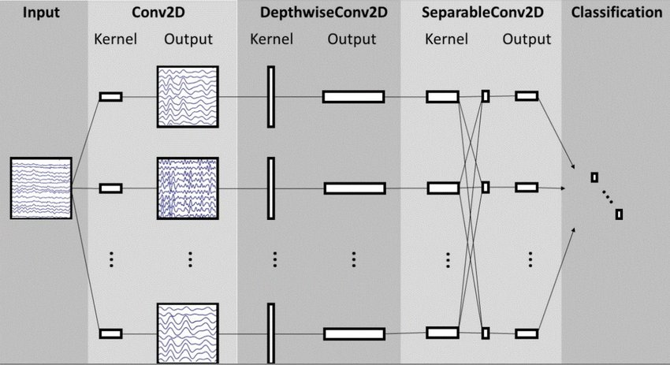

##### (a) Acurácia de classificação

A acurácia é uma das métricas mais simples para avaliar o desempenho de um modelo de classificação. Em termos simples, a acurácia mede a proporção de predições corretas feitas pelo modelo em relação ao total de predições. É uma métrica que pode dar uma visão geral do quão bem o modelo está performando em todas as classes (média por classe ou por conjunto de treino).

 - Matriz de confusão para acurácia dos dados reais

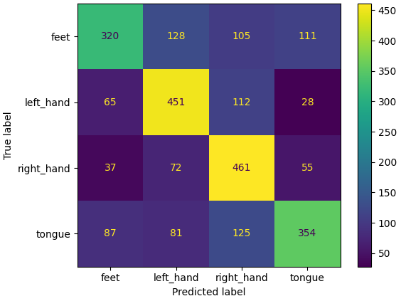

 - Matriz de confusão para acurácia da DCGAN

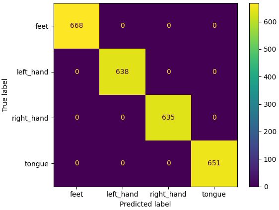

 - Matriz de confusão para acurácia da CNN-VAE

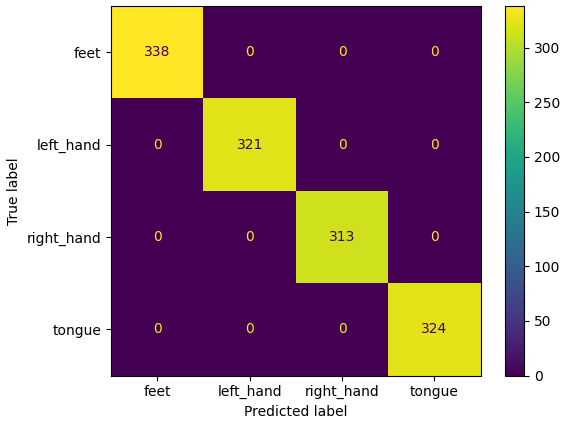

 - Matriz de confusão para acurácia da cLSTM-GAN

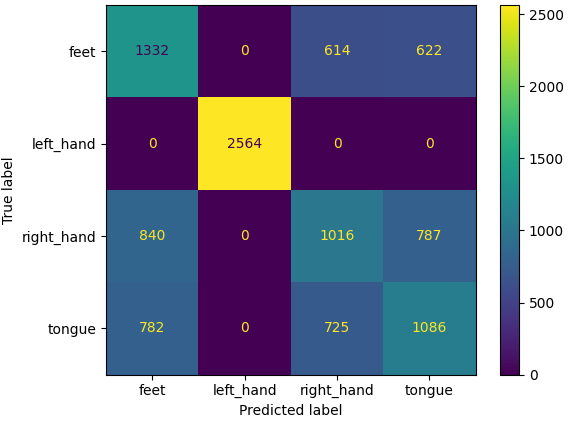

##### (b) Train on Synthetic, Test on Real (TSTR)

É uma abordagem muito utilizada para avaliar junto de um classificador a qualidade dos dados sintéticos. Para usá-la basta treinar um modelo usando dados sintéticos e depois testar o modelo em dados reais.

 - Matriz de confusão para TSTR da DCGAN

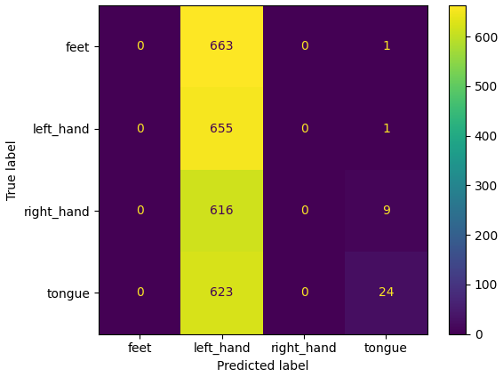

 - Matriz de confusão para TSTR da CNN-VAE

 - Matriz de confusão para TSTR da cLSTM-GAN

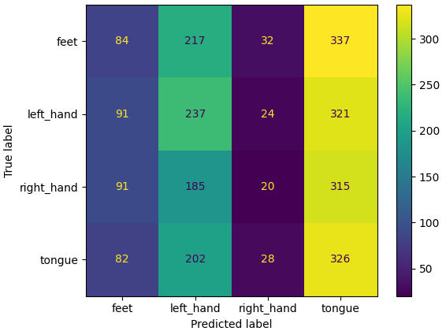

##### (c) Train on Real, Test on Synthetic (TRTS)

Outra abordagem avaliativa muito utilizada para avaliar os dados sintéticos gerados, porém funciona ao contrário da primeira. Para usá-la o modelo é treinado com dados reais e depois é testado em dados sintéticos.

 - Matriz de confusão para TRTS da DCGAN

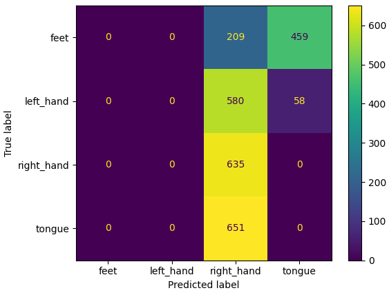

 - Matriz de confusão para TRTS da CNN-VAE

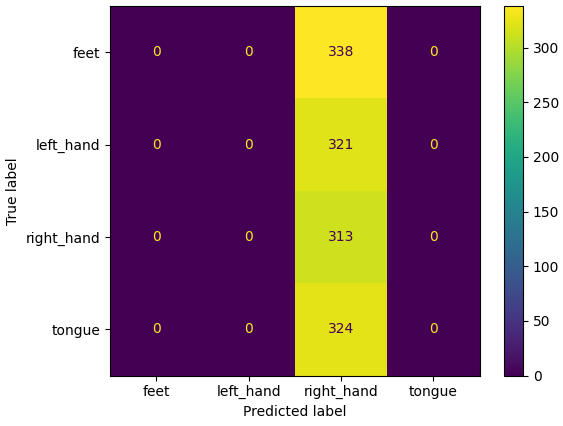

 - Matriz de confusão para TRTS da cLSTM-GAN

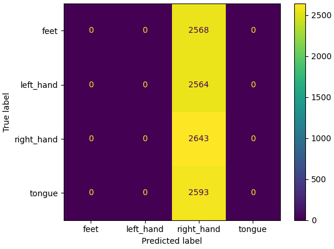

##### (d) Distância Euclidiana (ED)

É uma métrica que pode fornecer uma medida quantitativa da diferença entre os dados sintéticos em relação aos dados reais. Consegue expressar então quão bem os dados sintéticos representam a variabilidade e a distribuição dos dados reais.

## 6. Experimentos e Resultados
<!--
> Na entrega final do projeto (E3), essa seção deverá elencar os principais resultados obtidos (não necessariamente todos), que melhor representam o cumprimento dos objetivos do projeto.
> A discussão dos resultados pode ser realizada em seção separada ou integrada à seção de resultados. Isso é uma questão de estilo. Considera-se fundamental que a apresentação de resultados não sirva como um tratado que tem como único objetivo mostrar que "se trabalhou muito". O que se espera da seção de resultados é que ela apresente e discuta somente os resultados mais relevantes, que mostre os potenciais e/ou limitações da metodologia, que destaquem aspectos de performance e que contenha conteúdo que possa ser classificado como compartilhamento organizado, didático e reprodutível de conhecimento relevante para a comunidade.
-->
Para o treino das redes utilizamos o conjunto de dados descrito na Sessão Dados. Utilizamos todos os 9 pacientes e todos os 22 canais para os treinos.

Os parâmetros das redes para o treino foram:

- DCGAN

Utilizamos para o gerador e discriminador otimizador `Adam` com `learning rate` de `2e-4`, `betas=(0.5, 0.999)` e ` weight_decay=0.0002`. Como `criterion` usamos a `nn.BCELoss()`.

||**BATCH_SIZE** | **NOISE_DIM** | **HIDDEN_DIM**| **N_EPOCHS**|
|-----|----- | ----- | ------------------| ------------------|
| |128 | 100 | 32|20

- CNN-VAE

Utilizamos para a rede otimizador `Adam` com `learning rate` de `0.001`, respectivamente. Como `criterion` usamos a `nn.BCELoss(reduction='sum')`.

||**BATCH_SIZE** |  **N_EPOCHS**|
|-----|----- | ----- | 
| |72 | 100

- cLSTM-GAN

Utilizamos para o gerador e discriminador otimizador `Adam` com `learning rate` de `3e-4` e `1e-4`, respectivamente. Como `criterion` usamos a `nn.BCELoss()`.

||**BATCH_SIZE** | **NOISE_DIM** | **SIGNAL_DIM**| **HIDDEN_DIM**| **NUM_LSTM_LAYERS**| **N_EPOCHS**|
|-----|----- | ----- | ------------------| ------------------|------------------|------------------|
| |64100 | 100 |  1125|  64|2|400

Os resultados obtidos nas quatro métricas avaliadas podem ser visualizado na tabela ao lado. Como mencionado, esses resultados foram obtidos para um conjunto de dados conjunto de todos os 9 pacientes. 

||**Acurácia** | **TSTR** | **TRTS**| **ED (Euclidian Distance)**|
|-----|----- | ----- | ------------------| ------------------|
|Dados Reais|    0.5976|--|     --|    --| 
|Ruído Gaussiano|0.6343|0.6674| 0.6373 | 11,171.89
|DCGAN|         1.0000|0.2620| 0.2620 | 44,012.61 
|CNN-VAE|       1.0000|0.2504| 0.2504 | 23,613.57
|cLSTM-GAN|     0.5785|0.2573| 0.2549 | 15,045.13

### 6.2 Espectrogramas

Os resultados obtidos pelos os modelos podem ser mais facilmente visualizados ao realizar o cálculo de seus espectrogramas. Colocando os espectrogramas dos dados reais lado a lado com os espectrogramas dos dados sintéticos, é possível perceber uma grande diferença.

 - Dados reais

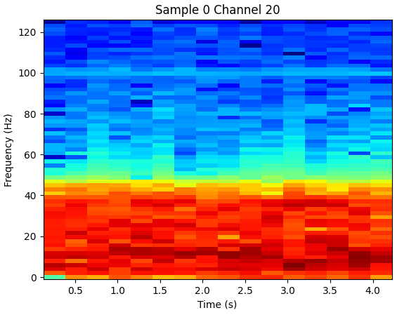

 - Ruido Gaussiano

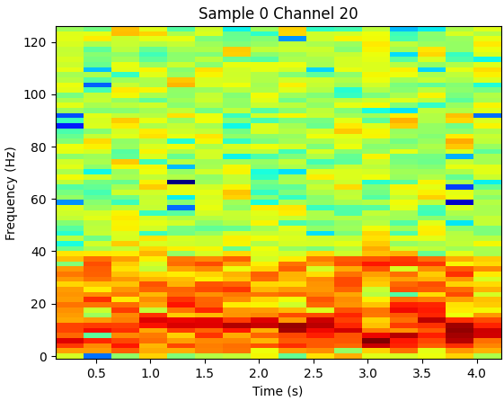

 - DCGAN

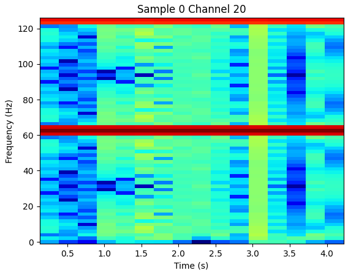

 - CNN-VAE

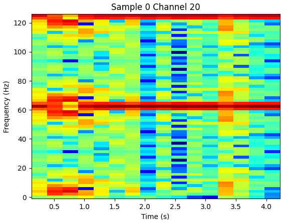

 - cLSTM-GAN

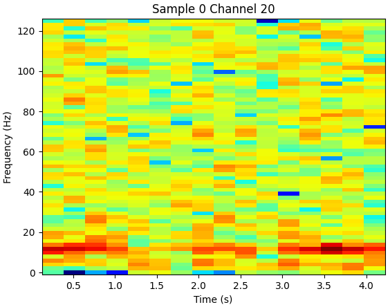

### 6.3 Acurácia por paciente

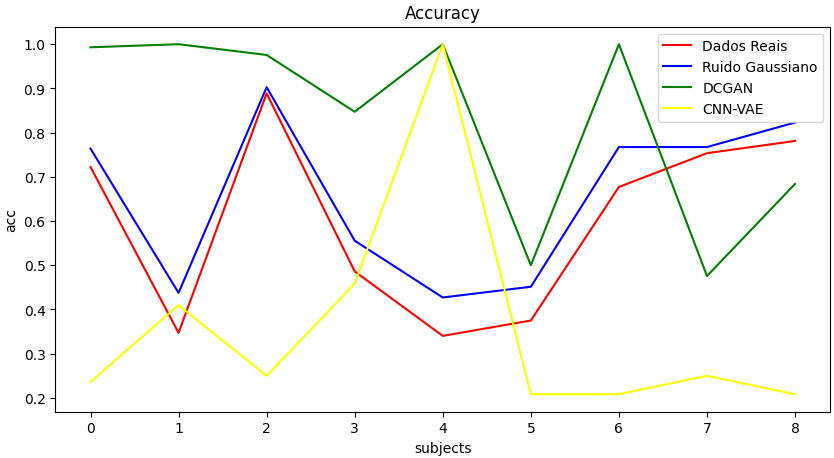

### 6.4 TSTR por paciente

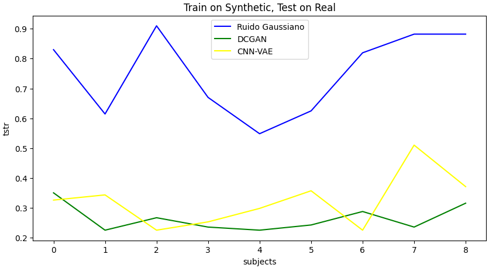

### 6.5 TRTS por paciente

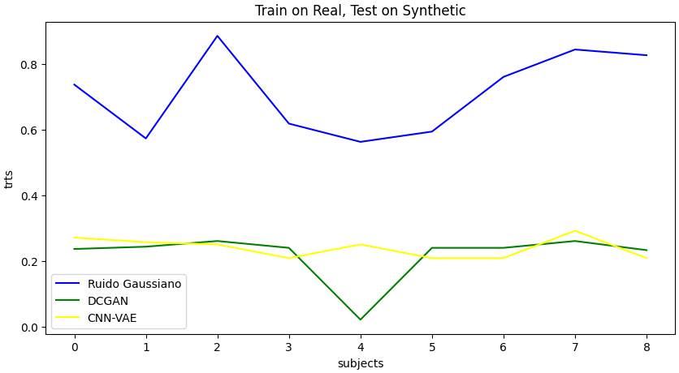

### 6.5 Distância Euclidiana por paciente

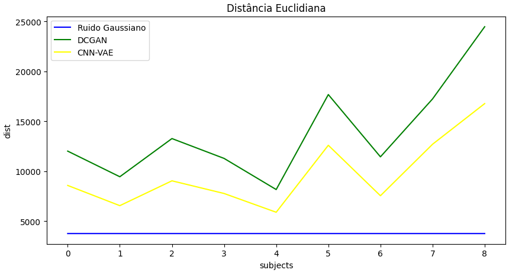

## 7. Conclusão
<!--
> A seção de Conclusão deve ser uma seção que recupera as principais informações já apresentadas no relatório e que aponta para trabalhos futuros. Na entrega parcial do projeto (E2) pode conter informações sobre quais etapas ou como o projeto será conduzido até a sua finalização. 
Na entrega final do projeto (E3) espera-se que a conclusão elenque, dentre outros aspectos, possibilidades de continuidade do projeto.
-->

Os resultados que obtidos pelos modelos não podem ser considerados bons em nenhuma das métricas aplicadas. Os resultados obtidos na métrica de acurácia são ilusórios, uma vez que a métrica de TSTR e TRTS demonstra que os dados sintéticos não conversam com os dados reais quando combinados. O que podemos concluir é que nossos modelos são pobres e não foram capazes de generalizar bem a distribuição dos dados de EEG.

Por mais que os modelos generativos treinados não tenham sido capazes de realizar a geração sintética de sinais de EEG de forma satisfatória, fomos capazes de demonstrar que a simples adição de ruído gaussiano pode ser uma forma muito mais simples, computacionalmente barata e eficiente de fazer data augmentation neste tipo de dado. Como podemos ver nos resultados, gráficos e espectrogramas, a adição de ruído gaussiano funciona tão bem quanto os dados reais no classificador que utilizamos.

Por fim, apesar dos resultados não terem sido satisfatórios lidar com diferentes redes neurais se fez desafiador, não somente no ajuste dos parâmetros como também no entendimento de como a adição de cada *layer* impacta na dimensão do *output* e no desempenho dos modelos. Para trabalhos futuros, seria interessante analisar uma rede condicional generativa com camadas LSTM e convolucionais, assim como também, tentar trabalhar com os dados na forma de espectogramas, forma de *input formulation* para séries temporais que está sendo muito recorrente na literatura [[14]](https://link.springer.com/article/10.1007/s00521-021-06352-5).

## 8. Cronograma

O cronograma proposto é uma estimativa temporal das principais etapas pelo projeto. Ademais, junto marcamos os *checkpoints* previstos para guiar e lembrar-nos das entregas e da geração das *release tags*.

## 9. References

[1] Tosato, G., Dalbagno, C. M., & Fumagalli, F. (2023). EEG Synthetic Data Generation Using Probabilistic Diffusion Models. arXiv preprint arXiv:2303.06068.

[2] Hartmann, K. G., Schirrmeister, R. T., & Ball, T. (2018). EEG-GAN: Generative adversarial networks for electroencephalographic (EEG) brain signals. arXiv preprint arXiv:1806.01875.

[3] Williams, C. C., Weinhardt, D., Wirzberger, M., & Musslick, S. (2023). Augmenting EEG with Generative Adversarial Networks Enhances Brain Decoding Across Classifiers and Sample Sizes. In Proceedings of the Annual Meeting of the Cognitive Science Society (Vol. 45, No. 45).

[4] Williams, C. C., Ferguson, T. D., Hassall, C. D., Abimbola, W., & Krigolson, O. E. (2021). The ERP, frequency, and time–frequency correlates of feedback processing: Insights from a large sample study. Psychophysiology, 58(2), e13722.

[5] Spampinato, C., Palazzo, S., Kavasidis, I., Giordano, D., Souly, N., & Shah, M. (2017). Deep learning human mind for automated visual classification. In Proceedings of the IEEE conference on computer vision and pattern recognition (pp. 6809-6817).

[6] Jayaram, V., & Barachant, A. (2018). MOABB: trustworthy algorithm benchmarking for BCIs. Journal of neural engineering, 15(6), 066011.

[7] Münßinger, J. I., Halder, S., Kleih, S. C., Furdea, A., Raco, V., Hösle, A., & Kübler, A. (2010). Brain painting: first evaluation of a new brain–computer interface application with ALS-patients and healthy volunteers. Frontiers in neuroscience, 4, 182.

[8] Gadhoumi, K., Lina, J. M., Mormann, F., & Gotman, J. (2016). Seizure prediction for therapeutic devices: A review. Journal of neuroscience methods, 260, 270-282.

[9] Marshall, D., Coyle, D., Wilson, S., & Callaghan, M. (2013). Games, gameplay, and BCI: the state of the art. IEEE Transactions on Computational Intelligence and AI in Games, 5(2), 82-99.

[10] Zhuang, J., & Yin, G. (2017, July). Motion control of a four-wheel-independent-drive electric vehicle by motor imagery EEG based BCI system. In 2017 36th Chinese Control Conference (CCC) (pp. 5449-5454). IEEE.

[11] Brophy, E., Wang, Z., She, Q., & Ward, T. (2023). Generative adversarial networks in time series: A systematic literature review. ACM Computing Surveys, 55(10), 1-31.

[12] Tangermann, M., Müller, K. R., Aertsen, A., Birbaumer, N., Braun, C., Brunner, C., ... & Blankertz, B. (2012). Review of the BCI competition IV. Frontiers in neuroscience, 55.

[13] https://www.medicine.mcgill.ca/physio/vlab/biomed_signals/eeg_n.htm, acessado em Outubro, 2023.

[14] Tian, C., Ma, Y., Cammon, J., Fang, F., Zhang, Y., & Meng, M. (2023). Dual-Encoder VAE-GAN With Spatiotemporal Features for Emotional EEG Data Augmentation. IEEE Transactions on Neural Systems and Rehabilitation Engineering.

[15] Bao, G., Yan, B., Tong, L., Shu, J., Wang, L., Yang, K., & Zeng, Y. (2021). Data augmentation for EEG-based emotion recognition using generative adversarial networks. Frontiers in Computational Neuroscience, 15, 723843.
