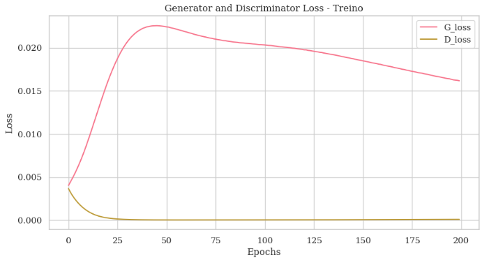

# `EEGen: Geração de Dados de EEG para BCI`
# `EEGen: EEG Synthetic Data Generation for BCI`

## Apresentação

O presente projeto foi originado no contexto das atividades da disciplina de pós-graduação IA376L - Deep Learning aplicado à Síntese de Sinais, oferecida no segundo semestre de 2023, na Unicamp, sob supervisão da Profa. Dra. Paula Dornhofer Paro Costa, do Departamento de Engenharia de Computação e Automação (DCA) da Faculdade de Engenharia Elétrica e de Computação (FEEC).

> |Nome  | RA | Especialização|
> |--|--|--|
> | Alexandre Herrero Matias  | 223665  | Eng. de Computação|
> | Maria Julia De Castro Villafranca Garcia | 183575  | Eng. Eletricista|

## Resumo (Abstract)
<!--
> Descrição do tema do projeto, incluindo contexto gerador, motivação.
> Descrição do objetivo principal do projeto.
> Esclarecer qual será a saída do modelo generativo.
> Incluir nessa seção link para vídeo de apresentação da proposta do projeto (máximo 5 minutos).
> Resumo do objetivo, metodologia e resultados obtidos (na entrega E2 é possível relatar resultados parciais). Sugere-se máximo de 100 palavras.
-->

Uma Interface Cérebro-Computador (BCI) é um sistema que permite identificar padrões cerebrais estáveis de indivíduos durante a execução de determinadas tarefas mentais. Uma vez identificados, é possível utilizá-los para diversas tarefas como controlar outros sistemas ou máquinas. 

Existem técnicas de gravação invasivas e não invasivas, que permitem monitorar a atividade elétrica do cérebro ao longo do tempo e em diferentes áreas cerebrais. Independente da técnica, a medição eficaz da atividade cerebral é o primeiro passo crítico em um sistema de BCI.

Um dos métodos não invasivos que nos permite monitorar a atividade elétrica do cérebro é a eletroencefalografia. O registro gerado pela eletroencefalografia é o eletroencefalograma (EEG), que mede, principalmente, a soma dos potenciais pós-sinápticos gerados por milhares de neurônios com a mesma orientação radial em relação a seu escalpo. Os sinais são medidos em microvolts e possuem como compoenentes de frequência, principalmente, Delta, Theta, Alpha ou Beta, como exemplificado abaixo.

#

## Descrição do Problema/Motivação
<!--
> Descrição do contexto gerador do tema do projeto. Motivação para abordar este tema de projeto.
-->
A principal motivação deste projeto vem do fato de que junto de técnicas de inteligência artificial, a aplicabilidade de dados EEG é vasta e fundamental. Dentro do âmbito dos MI-EEG (*motor imagery*), tipo de dados que serão utilizados no presente projeto, a aplicação se estender desde do auxílio de pessoas com paralizia severa a desenhar [[7]](#referências-bibliográficas), a trantamento de epilepsia [[8]](#referências-bibliográficas) e, melhoria da experiência em jogos [[9]](#referências-bibliográficas) e uso locomoção de veículos [[10]](#referências-bibliográficas). 

## Objetivo
<!--
> Descrição do que o projeto se propõe a fazer. É possível explicitar um objetivo geral e objetivos específicos do projeto.
-->

Dados de eletroencefalograma, se enquadram como dados médicos, e, portanto, não são simples de se coletar e não são distribuídos em grandes quantidades. Especialmente quando se busca mecanismos específicos de extração de informação de atividade cerebral. Nesse sentido, nos propomos a desenvolver um sistema de geração de dados de eletroencefalograma com a ideia de tais dados auxiliar nas pesquisas em BCI. Os dados gerados devem ser do modelo de extração de informação de atividade cerebral conhecido como imagética motora (*motor imagery*).

Os slides-report do projeto podem ser acessados [aqui](https://docs.google.com/presentation/d/1mkRYWdrhwL639Hv0Ji1hCzxZK0cqpVSVj9PF9gzU1TM/edit?usp=sharing). 

Uma apresentação em vídeo da proposta pode ser acessada [aqui](https://youtu.be/mS_asNZQ8po).

## Metodologia
<!--
> Descrever de maneira clara e objetiva, citando referências, a metodologia proposta para se alcançar os objetivos do projeto. Descrever bases de dados utilizadas. Citar algoritmos de referência. Justificar os porquês dos métodos escolhidos. Apontar ferramentas relevantes. Descrever metodologia de avaliação (como se avalia se os objetivos foram cumpridos ou não?).
-->

### Bases de Dados
<!--
> Elencar bases de dados utilizadas no projeto. Para cada base, coloque uma mini-tabela no modelo a seguir e depois detalhamento sobre como ela foi analisada/usada, conforme exemplo a seguir.
> Faça uma descrição sobre o que concluiu sobre esta base. Sugere-se que respondam perguntas ou forneçam informações indicadas a seguir:

> Qual o formato dessa base, tamanho, tipo de anotação?
> Quais as transformações e tratamentos feitos? Limpeza, reanotação, etc.
> Inclua um sumário com estatísticas descritivas da(s) base(s) de estudo.
> Utilize tabelas e/ou gráficos que descrevam os aspectos principais da base que são relevantes para o projeto.
-->

|**Base de Dados** | **Endereço na Web** | **Resumo descritivo**|
|----- | ----- | ------------------|
|BCI Competition IV 2a/BNCI2014_001|http://bnci-horizon-2020.eu/database/data-sets | |

Os dados foram obtidos através da biblioteca em Python chamada [Braindecode](https://braindecode.org/stable/index.html), que tem a deste dataset construído sobre outra biblioteca em Python, a MOABB. O site de referência é o site *source* direcionado pelo artigo ([[12]](#referências-bibliográficas)).

Nessa primeira parte buscamos nos familiarizar com os dados e também montar uma pipeline de modo a ficar mais fácil o teste de outros modelos generativos.

Os dados são baixados em formato `.mat` e são acessados por `subject_id`, no total há 9 voluntários saudáveis. Cada voluntário participou em duas sessões conduzidas em dias diferentes. Cada sessão teve 6 *runs* separados por *breaks* e tinham por objetivo registrar os sinais à partir da imaginação de 1 dos 4 movimentos, a saber: imaginação de movimento da mão esquerda, mão direita, ambos os pés e língua. Dentro dessas sessões cada um dos 6 *runs* consistiu de 48 *trials*, 12 para cada uma das 4 classes. 

A figura abaixo exemplifica a organização do dataset obtido junto do uso da biblioteca [Braindecode](https://braindecode.org/stable/index.html). É possível notar as principais frequências, que compõem do sinal (Delta, Theta, Alpha ou Beta).

A figura abaixo contém um exemplo dos sinais coletados `subject_id=3`. Observa-se que entre a tarefa (onde há faixa colorida), houve *breaks* (indicado pelas faixas em branco). Observa-se também que para todos os movimentos o sinal de todos os canais foram recolhidos.

Para o treino dos modelos utilizamos o `subject_id=3`. Os dados foram pré-processados, seguindo o tutorial fornecido pelo Braindecode ([aqui](https://braindecode.org/stable/auto_examples/plot_dataset_example.html#sphx-glr-auto-examples-plot-dataset-example-py)), de modo a remover quaisquer canais que não fosse canais de EEG, com o posterior escalonamento dos dados e filtragem dentro do intervalo [4, 38]Hz. Tal sequência de processamento foi baseada na observação dos artigos ([[1]](#referências-bibliográficas)-[[3]](#referências-bibliográficas)). Com diferença de nós, nesse primeiro momento, ter escolhido manter todos os 22 canais dos dados. Dessa forma, após o processamento dos dados, tem-se a seguinte configuração para os dados de treinamento: `X.size = [576, 1, 22, 1125]` e `y.size = [576]`.

### Workflow
<!--
> Use uma ferramenta que permita desenhar o workflow e salvá-lo como uma imagem (Draw.io, por exemplo). Insira a imagem nessa seção. Você pode optar por usar um gerenciador de workflow (Sacred, Pachyderm, etc) e nesse caso use o gerenciador para gerar uma figura para você. Lembre-se que o objetivo de desenhar o workflow é ajudar a quem quiser reproduzir seus experimentos.
-->
O workflow geral pode ser observado na figura abaixo. Em um primeiro momento o objetivo era familiarizar-se com os dados e montar uma *pipeline*, ilustrada na figura. A parte do processamento de dados foi discutido do tópico anterior. Na parte de `Modelo Generativo`, exploramos, as versões simples da GAN e da VAE. Familiarizando-se com a biblioteca Braindecode, decidimos obter de lá um classificador para ajudar na avaliação dos dados gerados. O classificador que escolhemos é o EEGNetv4, pois é um dos classificadores que vimos sendo usado nos artigos [[1]](#referências-bibliográficas) e [[2]](#referências-bibliográficas). Ademais, a ideia é ter os dados gerados avaliados não somente através da acurácia do classificador, mas também através de outras métricas. Por enquanto, temos somente a métrica Euclidean Distance implementada ([[2]](#referências-bibliográficas)).

#### Ferramentas
À princípio, as ferramentas que serão utilizadas serão: 

- [Pytorch](https://pytorch.org/)
- Notebook interfaces ([GoogleColab](https://colab.google/), [JupyterLab](https://jupyter.org/))

#### Instalação

Um passo-a-passo para fazer o set up do enviroment usando conda (miniconda, [here](https://docs.conda.io/projects/miniconda/en/latest/)) para esse projeto seria: 

- `conda create -n eeg python=3.9` 
- `conda activate eeg` 
- `pip install -r base_requirements.txt` 

E como Pytorch requirements, usamos (por curiosidade, ["The safest way to install CUDA and cuDNN is to use a conda environment"](https://jrkwon.com/2022/11/22/cuda-and-cudnn-inside-a-conda-env/#:~:text=The%20safest%20way%20to%20install,LD_LIBRARY_PATH%20needs%20to%20be%20used)):

- `conda install pytorch==1.12.1 torchvision==0.13.1 torchaudio==0.12.1 cudatoolkit=11.3 -c pytorch`

### Experimentos, Resultados e Discussão dos Resultados
<!--
> Na entrega final do projeto (E3), essa seção deverá elencar os principais resultados obtidos (não necessariamente todos), que melhor representam o cumprimento dos objetivos do projeto.
> A discussão dos resultados pode ser realizada em seção separada ou integrada à seção de resultados. Isso é uma questão de estilo. Considera-se fundamental que a apresentação de resultados não sirva como um tratado que tem como único objetivo mostrar que "se trabalhou muito". O que se espera da seção de resultados é que ela apresente e discuta somente os resultados mais relevantes, que mostre os potenciais e/ou limitações da metodologia, que destaquem aspectos de performance e que contenha conteúdo que possa ser classificado como compartilhamento organizado, didático e reprodutível de conhecimento relevante para a comunidade.
-->
O conjunto inicial é todos os 9 pacientes.
Como experimentos, decidimos utilizar um voluntário de 9, o `subject_id=3` para treino e teste dos modelos GAN e VAE. 

A GAN tem como gerador uma rede constituída de blocos com camadas [Linear, BatchNorm1d, ReLU] e o discriminador, blocos com camadas [Linear, LeakyReLU]. Ambos possuem como função de otimização o Adam com learning_rate de 1e5. A *loss function* utilizada é a Binary Cross-Entropy Loss with Logits. Os são gerados com *shape* [576, 24750], sem posteriormente redimensionados para [576, 22, 1125]. Por tanto, a rede é capaz de gerar dado para todos os canais.

Já a VAE é constituída de camadas [Linear]. A *loss function* da VAE tem como termo de reconstrução a BCE (Binary Cross-Entropy) e como termo de regularização o KL (Kullback-Leibler Divergence Term). Os são também são gerados com *shape* [576, 24750], e redimensionados para [576, 22, 1125]. Sendo também uma rede capaz de gerar dados de todos os canais.

|**Avaliação** | **GAN** | **VAE**| **ConvGAN** | **ConvVAE**| **LSTM-GAN**|
|----- | ----- | ------------------|
|TRTR|79.86%|79.51%|
|TRTS|27.78%|23.61%|
|TSTR|28.47%|35.07%|
|TSTS|22.22%|25.35%|
|ED (Euclidian Distance)|112.5746|113.4993|

|**Avaliação** | **ConvGAN** | **ConvVAE**| **LSTM-GAN**|
|----- | ----- | ------------------|------------------|
|TRTR|0%|0%|0%|
|TRTS|0%|0%|0%|
|TSTR|0%|0%|0%|
|TSTS|0%|0%|0%|
|ED (Euclidian Distance)|0|0|

Curvas de treinamento das redes:

CURVA 01
CURVA 02
CURVA 03

## Conclusão
<!--

> A seção de Conclusão deve ser uma seção que recupera as principais informações já apresentadas no relatório e que aponta para trabalhos futuros. Na entrega parcial do projeto (E2) pode conter informações sobre quais etapas ou como o projeto será conduzido até a sua finalização. 
Na entrega final do projeto (E3) espera-se que a conclusão elenque, dentre outros aspectos, possibilidades de continuidade do projeto.
-->
O proposto projeto buscou explorar a geração de dados sintéticos MI-EEG, visto a vasta aplicação e importância que possui. 
Com a *pipeline* quase totalmente definida, para E3 buscaremos um modelo que se comporte melhor com o formato do dado, considerando suas características. Para isso, temos alguns artigos separados de modelos generativos que possuem mecanismos capaz de atender tais características. Ademais, buscaremos termos mais controle sobre a geração das classes dos dados sintetizados.

## Cronograma
O cronograma proposto é uma estimativa temporal das principais etapas pelo projeto. Ademais, junto marcamos os *checkpoints* previstos para guiar e lembrar-nos das entregas e da geração das *release tags*.

## Referências Bibliográficas

[1] Tosato, G., Dalbagno, C. M., & Fumagalli, F. (2023). EEG Synthetic Data Generation Using Probabilistic Diffusion Models. arXiv preprint arXiv:2303.06068.

[2] Hartmann, K. G., Schirrmeister, R. T., & Ball, T. (2018). EEG-GAN: Generative adversarial networks for electroencephalographic (EEG) brain signals. arXiv preprint arXiv:1806.01875.

[3] Williams, C. C., Weinhardt, D., Wirzberger, M., & Musslick, S. (2023). Augmenting EEG with Generative Adversarial Networks Enhances Brain Decoding Across Classifiers and Sample Sizes. In Proceedings of the Annual Meeting of the Cognitive Science Society (Vol. 45, No. 45).

[4] Williams, C. C., Ferguson, T. D., Hassall, C. D., Abimbola, W., & Krigolson, O. E. (2021). The ERP, frequency, and time–frequency correlates of feedback processing: Insights from a large sample study. Psychophysiology, 58(2), e13722.

[5] Spampinato, C., Palazzo, S., Kavasidis, I., Giordano, D., Souly, N., & Shah, M. (2017). Deep learning human mind for automated visual classification. In Proceedings of the IEEE conference on computer vision and pattern recognition (pp. 6809-6817).

[6] Jayaram, V., & Barachant, A. (2018). MOABB: trustworthy algorithm benchmarking for BCIs. Journal of neural engineering, 15(6), 066011.

[7] Münßinger, J. I., Halder, S., Kleih, S. C., Furdea, A., Raco, V., Hösle, A., & Kübler, A. (2010). Brain painting: first evaluation of a new brain–computer interface application with ALS-patients and healthy volunteers. Frontiers in neuroscience, 4, 182.

[8] Gadhoumi, K., Lina, J. M., Mormann, F., & Gotman, J. (2016). Seizure prediction for therapeutic devices: A review. Journal of neuroscience methods, 260, 270-282.

[9] Marshall, D., Coyle, D., Wilson, S., & Callaghan, M. (2013). Games, gameplay, and BCI: the state of the art. IEEE Transactions on Computational Intelligence and AI in Games, 5(2), 82-99.

[10] Zhuang, J., & Yin, G. (2017, July). Motion control of a four-wheel-independent-drive electric vehicle by motor imagery EEG based BCI system. In 2017 36th Chinese Control Conference (CCC) (pp. 5449-5454). IEEE.

[11] Brophy, E., Wang, Z., She, Q., & Ward, T. (2023). Generative adversarial networks in time series: A systematic literature review. ACM Computing Surveys, 55(10), 1-31.

[12] Tangermann, M., Müller, K. R., Aertsen, A., Birbaumer, N., Braun, C., Brunner, C., ... & Blankertz, B. (2012). Review of the BCI competition IV. Frontiers in neuroscience, 55.