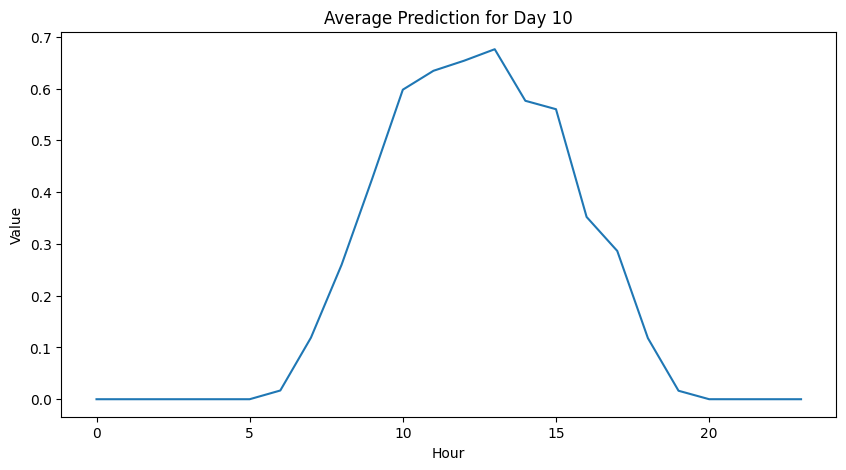

# `Synthetic Photovoltaic Power Curve using GANs and Transformers`

## Presentation

[Video on YouTube for the first assignment](https://youtu.be/TmnOccnPoUU)

This project was developed in the post-graduate class IA376 - Deep Learning Applied to Signal Synthesis, offered in the second semester of 2023 at the University of Campinas (UNICAMP), supervised by Prof. Paula Dornhofer Paro Costa, Ph.D., from the Department of Computer Engineering and Automation (DCA) of the School of Electrical and Computer Engineering (FEEC)

Group:
|Names                                   | Academic Record |  Course                                         |
|----------------------------------------|-----------------|-------------------------------------------------|
| Cristian Javier Maza Merchan           | 272289          | 
M.Sc. Student of Electrical Engineering   (Telecommunications and Telematics)
|
| Juan Carlos Cortez Aucapiña            | 265568          | 
Ph.D. Student of Electrical Engineering   (Energy)
|
| Lucas Zenichi Terada                   | 182775          | 
M.Sc. Student of Electrical Engineering   (Energy)
|

## Abstract

This project proposes generating synthetic daily photovoltaic (PV) generation curves by leveraging historical PV power and weather data using generative models such as normalizing flows, conditional generative adversarial networks (GANs), and transformers. Subsequently, the trained model generates synthetic data for a different geographical location to complete missing data and train a day ahead PV forecasting model where only weather data is available. The forecasting model will be constructed using a Long Short-Term Memory (LSTM) network. The forecasting algorithm's performance will be evaluated based on Mean Absolute Error (MAE) and Root Mean Square Error (RMSE).

## Description

The increase of Distributed Energy Resources (DERs) integration into the distribution grid has heightened the need for Energy Management Systems (EMSs) to achieve optimal control of devices such as Battery Energy Storage Systems (BESS) and Electric Vehicle Charging Stations (EVCSs). Figure 1 illustrates an example environment in which an EMS is required to optimize Electric Vehicles (EVs) charging.

Figure 1: Example os environment that need to be controlled with an EMS

To enhance the quality of energy management, predictions such as load and photovoltaic (PV) generation are necessary. However, how can an EMS be applied in a system without historical data? How can a PV forecasting model be trained to assist an EMS in a system installed in a new location?

Therefore, this project aims to generate synthetic PV generation data based on climatic data. The synthetic data will be used to train a prediction model, and an evaluation will be conducted to quantify the performance of these approaches.

### Related works

The following papers address GANs for time series generation and will be used as a guide for this work.

* Reference articles:
  * *[RCGAN](https://arxiv.org/pdf/1706.02633.pdf)* (Recurrent Conditional GAN) is a framework for training models to produce realistic real-valued multi-dimensional time series, with an emphasis on their application to medical data. RGANs make use of recurrent neural networks in the generator and the discriminator (Esteban, Hyland, & Rätsch, 2017).

  * *[RTSGAN](https://arxiv.org/pdf/2111.08386.pdf)* (Real-world Time Series GAN) is a novel generative framework for real-world time series data. RTSGAN first learns an encoder-decoder module which provides a mapping between a time series instance and a fixed-dimension latent vector and then learns a generation module to generate vectors in the same latent space (Pei, Ren, Yang, Liu, Qin, & Li, 2021).

  * *[TimeVAE](https://arxiv.org/pdf/2111.08095.pdf)* (Time-series Variational Auto-Encoder) is a novel architecture for synthetically generating time-series data with the use of Variational Auto-Encoders (VAEs). The proposed architecture has several distinct properties: interpretability, ability to encode domain knowledge, and reduced training times (Desai, Freeman, Wang, & Beaver, 2021).

  * *[TimeGAN](https://papers.nips.cc/paper/2019/file/c9efe5f26cd17ba6216bbe2a7d26d490-Paper.pdf)* (Time-series Generative Adversarial Network) is a framework for generating synthetic time-series data. The goal is to create smoothed time series data via a GAN. The paper proposes a novel approach for generating realistic time-series data using supervised and unsupervised learning techniques. (Yoon, Jordon, & van der Schaar, 2019).

  * *[TSGAN](https://arxiv.org/pdf/2006.16477.pdf)* (Time Series GAN) is a novel architecture that uses two GANs in unison to model fake time series examples. TSGAN focuses on one dimensional times series and explores the few shot approach, which is the ability of an algorithm to perform well with limited data (Wang, Zhang, & Zhang, 2020).

The groundwork for this study is rooted in the [Reference Paper](https://doi.org/10.1016/j.apenergy.2021.117871), a publication featured in Applied Energy. The paper introduces a deep learning technique known as normalizing flows(NF), which is designed to produce accurate scenario-based probabilistic forecasts. It compares NF with other state-of-the-art DL generative models, such as generative adversarial networks and variational autoencoders, in generating weather-based wind, PV power, and load scenarios.

## Methodology

The proposed framework uses two datasets to extrapolate PV power behavior from the first to the second dataset. It is supposed that the first dataset contains PV power and weather data, while the second dataset only has weather information. A generative model is trained to generate new PV samples from weather and PV data using the first dataset. This project uses normalizing flows (NF), CGAN, and Transformers as generative models. Upon training the generative model, it is used to generate synthetic PV curves from the weather data of the second dataset. These synthetic PV curves and the weather variables are the input for the day-ahead PV power prediction model based on LSTM networks. The final evaluation of the approach is carried out using MAE and RMSE for the forecasting model. The proposed framework is shown in Figure 2.

Figure 2: Proposed Framework

<!--The creation of synthetic data will be carried out using three different architectures. One of them will be based on a conditional GAN, as shown in Figure 3. Additionally, another architecture based on flow models or transformers will be proposed for synthetic PV data generation.

Figure 3: Proposed Conditional GAN -->

* Tools:
  * Python 3
  * Google Colab
  * PyTorch
  * Weights & Biases

## Dataset

The proposed framework uses two datasets of real PV installations. The PV installations are shown in Figures 3 and 4 respectively. The description of the datasets is presented in Table I.

Table I: Datasets
| **ID** | **Dataset** |     **Availability**          |                                                                               **Description**  |
|:------:|:-----------:|:----------------------------------:|:------------------------------------------------------------------------------------------------------------------------------------------------------------------------------------------------------------------------------------------------------------------------------------------:|
|    1   |   UNICAMP   | Not Public. Available upon request | PV power data from a solar farm located in Campinas, Brazil at UNICAMP, of 276.5 kWp. Weather data was obtained from a meteorological station, and complementary features such as irradiation were obtained from [Solcast](https://solcast.com/). The timestamp of the dataset is 15 minutes and spans four years. |
|    2   |    GECAD    | Not Public. Available upon request | PV power data from rooftop PV arrays of 7.5 kWp, located in Porto, Weather data for this location is sourced from [Solcast](https://solcast.com/), and the dataset comprises timestamps at 5-minute intervals, covering a period of nearly four years.|

Figure 3: UNICAMP

Figure 4: GECAD 

The datasets are used as follows. Historical PV generation data from UNICAMP and data are employed to train PV generative models. Synthetic PV power data is obtained using the generative model, and the weather features from the GECAD dataset. Finally, the synthetic PV data and weather features are used to train a day-ahead PV power forecasting model.

## Workflow

## Experiments, Results and Discussion

As a first step, a code available in a [GitHub repository](https://github.com/jonathandumas/generative-models) made by the authors of the [reference paper](https://doi.org/10.1016/j.apenergy.2021.117871) is used to implement the NF. Here, some difficulties emerged, such as understanding the code developed by its authors and adapting it for use with the UNICAMP dataset. In this phase, the code was simplified by removing the other generative models proposed in the [reference paper](https://doi.org/10.1016/j.apenergy.2021.117871) and functions that were not interesting to our proposal. The load data generation code of that paper was adapted to generate the PV curves of our dataset, given that the [reference paper](https://doi.org/10.1016/j.apenergy.2021.117871) uses the PV of three different zones while the load model is only one. The UNICAMP data pre-processing included resampling the features every hour. This adaptation to the UNICAMP dataset required the optimization of the hyperparameters of the NF model. Therefore, the hyperparameters of the model are optimized using Bayesian optimization using Weights & Biases. Seventy different architectures were evaluated, minimizing the RMSE as an objective function. Figure 5 shows the Optimization history plot, and Figure 6 shows the parallel coordinates plot. It is highlighted that the best model was obtained in iteration 69 and will be used to generate the synthetic data from the GECAD database. 

Figure 5: Optimization History

Figure 6: Parallel coordinates plot 

Figure 7: 100 synthetic PV curves for a single day

Figure 8: Average PV curve for a single day

The PV generation model will be evaluated using the method described in Figure 4. The proposed method will compare the model's performance when trained on synthetic data generated through data augmentation by the generator and real data.

Figure 9: Evaluation method
                                             

## Tasks

- [ ] Search for additional datasets: Look for more datasets to enhance your research.
- [ ] Dataset preparation, filtering, and correction: Clean, preprocess, and rectify the dataset to ensure data quality.
- [ ] Creation of the CGAN-based architecture: Develop a Conditional Generative Adversarial Network (CGAN) architecture.
- [ ] Creation of a more suitable architecture for time series data: Develop an architecture specifically tailored for time series data.
- [ ] Analysis of the distribution of generated data: Assess the distribution of the synthetic data.
- [ ] Evaluation of the proposal based on the proposed methodology: Conduct an evaluation of your research based on the outlined methodology.
- [ ] Project finished  :tada: 

## References

* Esteban, C., Hyland, S. L., & Rätsch, G. (2017). Real-valued (medical) time series generation with recurrent conditional GANs. arXiv preprint arXiv:1706.02633.
* Pei, H., Ren, K., Liu, C., Yang, Y., Qin, T., & Li, D. (2021). Towards Generating Real-World Time Series Data. arXiv preprint arXiv:2111.08386.
* Desai, A., Freeman, C., Wang, Z., & Beaver, I. (2021). TimeVAE: A Variational Auto-Encoder for Multivariate Time Series Generation. arXiv preprint arXiv:2111.08095.
* Yoon, J., Jordon, J., & van der Schaar, M. (2019). Time-series Generative Adversarial Networks. In Advances in Neural Information Processing Systems (pp. 5509-5520).
* Smith, K. E., & Smith, A. O. (2020). Conditional GAN for timeseries generation. arXiv preprint arXiv:2006.16477.
* Dumas, J., Wehenkel, A., Lanaspeze, D., Cornélusse, B., & Sutera, A. (2022). A deep generative model for probabilistic energy forecasting in power systems: normalizing flows. Applied Energy, 305, 117871.
