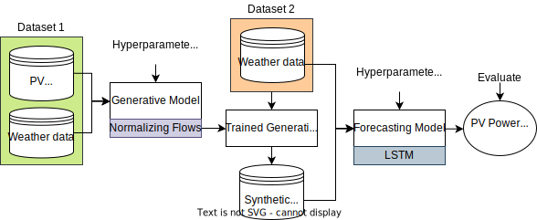
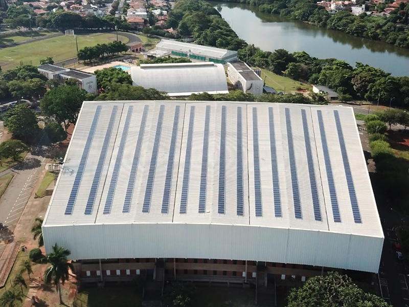
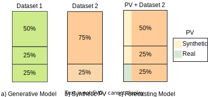
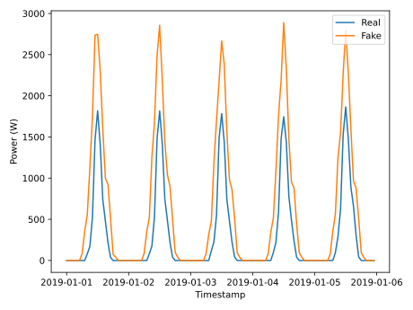

# `Synthetic Photovoltaic Power Curve using GANs and Transformers`

## Presentation

### Assigment 1

[Video on YouTube for the first assignment](https://youtu.be/TmnOccnPoUU)

### Assigment 2

[Slides](https://docs.google.com/presentation/d/1MgKqQnf7F7JzvSkJVg6RY7zdao9B-Bte/edit?usp=sharing&ouid=105026589240211170070&rtpof=true&sd=true)

This project was developed in the post-graduate class IA376 - Deep Learning Applied to Signal Synthesis, offered in the second semester of 2023 at the University of Campinas (UNICAMP), supervised by Prof. Paula Dornhofer Paro Costa, Ph.D., from the Department of Computer Engineering and Automation (DCA) of the School of Electrical and Computer Engineering (FEEC)

Group:
|Names                                   | Academic Record |  Course                                         |
|----------------------------------------|-----------------|-------------------------------------------------|
| Cristian Javier Maza Merchan           | 272289          | 
M.Sc. Student of Electrical Engineering   (Telecommunications and Telematics)
|
| Juan Carlos Cortez Aucapiña            | 265568          | 
Ph.D. Student of Electrical Engineering   (Energy)
|
| Lucas Zenichi Terada                   | 182775          | 
M.Sc. Student of Electrical Engineering   (Energy)
|

## Abstract

This project proposes generating synthetic daily photovoltaic (PV) generation curves by leveraging historical PV power and weather data using generative models such as normalizing flows, conditional generative adversarial networks (GANs), and transformers. Subsequently, the trained model generates synthetic data for a different geographical location to complete missing data and train a day ahead PV forecasting model where only weather data is available. The forecasting model will be constructed using a Long Short-Term Memory (LSTM) network. The forecasting algorithm's performance will be evaluated based on Mean Absolute Error (MAE) and Root Mean Square Error (RMSE).

## Description

The increase of Distributed Energy Resources (DERs) integration into the distribution grid has heightened the need for Energy Management Systems (EMSs) to achieve optimal control of devices such as Battery Energy Storage Systems (BESS) and Electric Vehicle Charging Stations (EVCSs). Figure 1 illustrates an example environment in which an EMS is required to optimize Electric Vehicles (EVs) charging.

Figure 1: Example os environment that need to be controlled with an EMS

To enhance the quality of energy management, predictions such as load and photovoltaic (PV) generation are necessary. However, how can an EMS be applied in a system without historical data? How can a PV forecasting model be trained to assist an EMS in a system installed in a new location?

Therefore, this project aims to generate synthetic PV generation data based on climatic data. The synthetic data will be used to train a prediction model, and an evaluation will be conducted to quantify the performance of these approaches.

### Reference Paper
The groundwork for this study is rooted in the [Reference Paper](https://doi.org/10.1016/j.apenergy.2021.117871), a publication featured in Applied Energy. The paper introduces a deep learning technique known as normalizing flows (NF), which is designed to produce accurate scenario-based probabilistic forecasts. It compares NF with other state-of-the-art DL generative models, such as generative adversarial networks and variational autoencoders, in generating weather-based wind, PV power, and load scenarios.

## Methodology

The proposed framework uses two datasets to extrapolate PV power behavior from the first to the second dataset. It is supposed that the first dataset contains PV power and weather data, while the second dataset only has weather information. A generative model is trained to generate new PV samples from weather and PV data using the first dataset. This project uses normalizing flows (NFs) as a generative model. Upon training NFs model, it is used to generate synthetic PV curves from the weather data of the second dataset. These synthetic PV curves and the weather variables are the input for the day-ahead PV power prediction model based on LSTM networks. The hyperparameter of the generative model and the forecasting model are optimized with a Bayesian algorithm using Weights & Biases and Optuna respectively. The proposed framework is shown in Figure 2.

Figure 2: Proposed Framework

Regarding NF model, figure 3 shows the architecture used and its hyperparameters. 

Figure 3: 

* Steps: A specific transformation is applied to the data on each step changing its distribution to make it more similar to the target distribution.

* Layers: The "Flows" transform the data, they are neural networks, composed of layers.

* Neurons: Each Layer is composed by neurons. They take in input, work together to apply a function to it and produce an output.

### Tools

| Library           | Description                                                                                                                                                                                            |
|-------------------|--------------------------------------------------------------------------------------------------------------------------------------------------------------------------------------------------------|
| Python 3          | Python 3 is a high-level programming language known for its readability and vast community support. It offers a wide range of libraries and frameworks for various purposes, making it versatile for tasks ranging from scripting to web development and data analysis to machine learning.  |
| Google Colab      | Google Colab (Colaboratory) is a cloud-based Jupyter notebook environment provided by Google, commonly used for machine learning, data analysis, and collaboration due to its accessibility and integration with Google Drive.  |
| PyTorch           | PyTorch is an open-source machine learning library known for its flexibility and ease of use in building and training deep neural networks, providing dynamic computation graphs facilitating faster experimentation in deep learning.  |
| Weights & Biases  | Weights & Biases (wandb) is a platform designed for experiment tracking, visualization, and collaboration in machine learning projects, enabling better reproducibility and collaboration through experiment logging and result visualization.  |
| Optuna            | Optuna is a hyperparameter optimization framework automating the process of tuning machine learning models, providing an easy-to-use interface and various algorithms for efficient hyperparameter search, enhancing model performance.  |
| TensorFlow        | TensorFlow is an open-source machine learning framework known for its scalability and extensive use in building and deploying machine learning models across various domains.  |
| scikit-learn      | scikit-learn is a machine learning library providing simple and efficient tools for data mining and analysis, built on NumPy, SciPy, and matplotlib. It offers various algorithms for classification, regression, clustering, and more.  |

### Dataset

The proposed framework uses two datasets of real PV installations. The PV installations are shown in Figures 3 and 4 respectively. The description of the datasets is presented in Table I.

Table I: Description of the datasets

| **ID** | **Dataset** |     **Availability**          |                                                                               **Description**  |
|:------:|:-----------:|:----------------------------------:|:------------------------------------------------------------------------------------------------------------------------------------------------------------------------------------------------------------------------------------------------------------------------------------------:|
|    1   |   UNICAMP   | Not Public. Available upon request | PV power data from a solar farm located in Campinas, Brazil at UNICAMP, of 276.5 kWp. Weather data was obtained from a meteorological station, and complementary features such as irradiation were obtained from [Solcast](https://solcast.com/). The timestamp of the dataset is 15 minutes and spans four years. |
|    2   |    GECAD    | Not Public. Available upon request | PV power data from rooftop PV arrays of 7.5 kWp, located in Porto, Weather data for this location is sourced from [Solcast](https://solcast.com/), and the dataset comprises timestamps at 5-minute intervals, covering a period of nearly four years.|

Figure 3: UNICAMP

Figure 4: GECAD 

The datasets are used as follows. Historical PV power data from UNICAMP and weather data are employed to train the PV generative model. UNICAMP dataset is split randomly 50% for training (2 years), 25% for validation (1 year), and 25% for testing (1 year) as can be seen in Figure 5a. Synthetic PV power is obtained using 75% of the GECAD dataset using only weather features as input; the remaining 25%, which corresponds to the data of the last year, is not used (see Figure 5b). For the forecasting model, the synthetic PV is concatenated to GECAD dataset and used chronologically for training the forecasting model, which means that 50% of the data is used for training and 25% for validating. Finally, the last 25% is used to evaluate the entire methodology, where real PV data is concatenated with the available weather data (see Figure 5c). 

Figure 5: Dataset splits

### Evaluation

The evaluation of the framework is proposed using two different approaches. 

 - Compute the MAE and RMSE of the day ahead PV power forecasts obtained for the GECAD database, for the test set. The test dataset contains the historical values of real PV. For this evaluation, a forecasting model is also trained for GECAD using historical PV power that is assumed not to be available for the proposed methodology.
 -	Transfer Learning. To do this, a forecast model is trained for the UNICAMP database, and one year of synthetic data is used to adjust the weights of the initial model, based on three transfer learning strategies described in this [paper]([https://www.nature.com/articles/s41598-022-18516-x]).

## Workflow

On working...

## Experiments, Results and Discussion

The experiments and results were divided into three analysis cases. These cases differ in their approach. 

BEST GECAD

|metric |  valid  |  test   |
|-------|---------|---------|
| MAE   | 0.05230 | 0.06313 |
| RMSE  | 0.08501 | 0.10154 |

### Case 1: Synthetic GECAD PV profile generation using models trained with UNICAMP PV data.

The first case involves generating synthetic data for GECAD's rooftop PV generation at IPP using a model trained solely with UNICAMP's databases. To determine the best data generation model for this dataset, a hyperparameter optimization (HPO) was conducted, as depicted in the Figure below.

Figure x: Hyperparameter Optimization Results

The following figure compares the generated and actual data for the corresponding period. It is important to note that the model used the parameters defined by the previously mentioned HPO.
                                             

Figure x: Qualitative Analysis between Real and Generated Data

Regarding metrics, the Mean Absolute Error (MAE) between the generated and synthetic data (both normalized) was 0.1057. Meanwhile, the Root Mean Square Error (RMSE) obtained was 0.1195.

**Talking about the prediction...**
XX

|metric |  valid  |  test   |
|-------|---------|---------|
| MAE   | 0.00854 | 0.11554 |
| RMSE  | 0.01391 | 0.16549 |

**An overview of the results...**

### Case 2: Synthetic UNICAMP PV Profile Generation by Models Trained with UNICAMP PV Data

To investigate the reasons behind the low performance of the generative model, a proposal for data generation for a subset of UNICAMP was made. Thus, the subset of data corresponding to 2023 was used as generation parameters, while the remaining data was used to train the model. In this case, the system exhibited poorer performance with an MAE of 0.1172 and an RMSE of 0.1370. The following figure illustrates an example of 5 generated days for qualitative analysis.

Figure x: Qualitative Analysis between Real and Generated Data

**An overview of the results...**

### Case 3: Synthetic GECAD PV Profile Generation by Models Trained with UNICAMP and NETHERLANDS PV Data

Since the model trained solely on one database did not yield satisfactory results, training with data from two distinct locations was attempted. For this new dataset, an HPO was conducted, as depicted in the following Figure.

Figure x: Hyperparameter Optimization Results

After training the model with the lowest RMSE, the obtained data could have been more satisfactory, with an MAE of 0.1140 and an RMSE of 0.1259. The following figure illustrates a qualitative comparison between the synthetic and real data.

Figure x: Qualitative Analysis between Real and Generated Data

|metric |  valid  |  test   |
|-------|---------|---------|
| MAE   | 0.01178 | 0.12083 |
| RMSE  | 0.01755 | 0.16712 |

## Transfer Learning

### Unicamp + Fine Tuning with Real PV Power

| Metrics |   w/o    |    E1    |    E2    |    E3    |
|---------|----------|----------|----------|----------|
|   MAE   | 0.20273  | 0.08745  | 0.07684  | 0.11176  |
|   RMSE  | 0.26323  | 0.12775  | 0.11427  | 0.16528  |

### Unicamp + Fine Tuning with Synthetic PV Power

| Metrics |   w/o    |    E1    |    E2    |    E3    |
|---------|----------|----------|----------|----------|
|   MAE   | 0.20273  | 0.12259  | 0.12168  | 0.11422  |
|   RMSE  | 0.26323  | 0.1665   | 0.15796  | 0.16168  |

## Discussion

## References

* Esteban, C., Hyland, S. L., & Rätsch, G. (2017). Real-valued (medical) time series generation with recurrent conditional GANs. arXiv preprint arXiv:1706.02633.
* Pei, H., Ren, K., Liu, C., Yang, Y., Qin, T., & Li, D. (2021). Towards Generating Real-World Time Series Data. arXiv preprint arXiv:2111.08386.
* Desai, A., Freeman, C., Wang, Z., & Beaver, I. (2021). TimeVAE: A Variational Auto-Encoder for Multivariate Time Series Generation. arXiv preprint arXiv:2111.08095.
* Yoon, J., Jordon, J., & van der Schaar, M. (2019). Time-series Generative Adversarial Networks. In Advances in Neural Information Processing Systems (pp. 5509-5520).
* Smith, K. E., & Smith, A. O. (2020). Conditional GAN for timeseries generation. arXiv preprint arXiv:2006.16477.
* Dumas, J., Wehenkel, A., Lanaspeze, D., Cornélusse, B., & Sutera, A. (2022). A deep generative model for probabilistic energy forecasting in power systems: normalizing flows. Applied Energy, 305, 117871.
* Sarmas, E., Dimitropoulos, N., Marinakis, V., Mylona, Z., & Doukas, H. (2022). Transfer learning strategies for solar power forecasting under data scarcity. Scientific Reports, 12(1), 14643.
