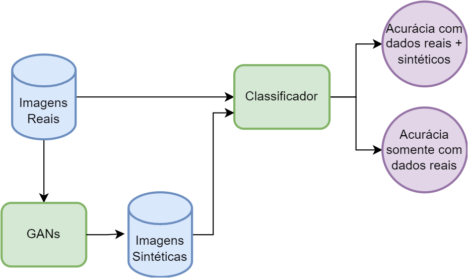
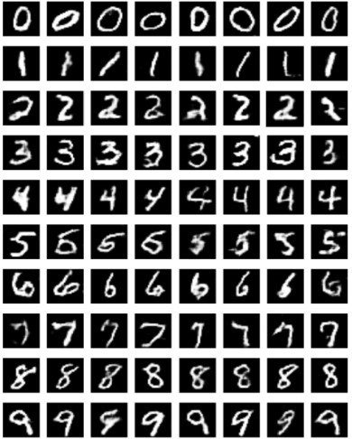
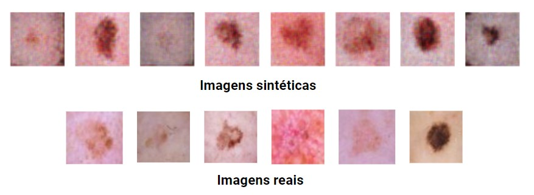

# `Síntese de Imagens de Lesões de Pele`
# `Synthesis of Skin Lesions Images`

## Apresentação

O presente projeto foi originado no contexto das atividades da disciplina de pós-graduação *IA376L - Deep Learning aplicado a Síntese de Sinais*, 
oferecida no segundo semestre de 2023, na Unicamp, sob supervisão da Profa. Dra. Paula Dornhofer Paro Costa, do Departamento de Engenharia de Computação e Automação (DCA) da Faculdade de Engenharia Elétrica e de Computação (FEEC).

 |Nome  | RA | Especialização|
 |--|--|--|
 | Thiago Soares Laitz  | 224898  | Eng. Eletricista |
 | Vinícius Hirono Gonçalves  | 188182  | Eng. Eletricista |

Apresentação - [Link](https://docs.google.com/presentation/d/1PrUui6LvmY9h1L6cxschIxMUiQ440VCA6t7QTRwDI1g/edit?usp=sharing)

## Resumo (Abstract)
 O projeto consiste em explorar formas de data augmentation para imagens de lesões de pele utilizando GANs, com o objetivo de melhorar a precisão dos modelos de classificação. Para isso, utilizaremos o dataset HAM10000, disponível no Kaggle, que contém 10015 imagens de lesões de pele, classificadas em 7 classes. Os modelos explorados serão a ACGAN e a ProGAN, que têm mostrado resultados promissores em tarefas de síntese de imagens.

## Descrição do Problema/Motivação
 Apesar da crescente disponibilidade de conjuntos de dados públicos de alta qualidade, a escassez de amostras de dados médicos de treinamento ainda é um dos principais desafios do deep learning para análise de lesões na pele. Redes Generativas Adversariais (GANs) surgem como uma hipótese para data augmentation, com a esperança de criar amostras que são praticamente indistinguíveis de dados reais porém sem a preocupação com a quebra de sigilo médico.

## Objetivo
Descobrir se usar data augmentation a partir de uma ACGAN ou ProGAN é capaz de melhorar a qualidade de classificadores de lesões de pele.

## Metodologia Proposta
Treinar ACGANs e ProGANs em um dataset isolado de cada tipo de lesão de pele. Gerar novas imagens usando os modelos treinados. Treinar um classificador usando o dataset aumentado e comparar sua precisão ao classificador treinado com o dataset original

### Bases de Dados e Evolução
HAM10000, processado em .jpg 64x64 64int, guardado no Git. 
checkpoint da ACGAN e PROGAN treinadas, guardadas no Drive local Google Colab + backup no Git (pasta reports/figures).

### Workflow

## Experimentos, Resultados e Discussão dos Resultados
Foram realizados experimentos envolvendo a GAN tradicional na geração de imagens sintéticas para o HAM10000, com o objetivo de verificar a viabilidade da abordagem. Os resultados qualitativos obtidos foram satisfatórios visualmente para as classes com uma boa quantidade de imagens disponíveis (+1000), porém houve uma grande dificuldade em gerar dados sintéticos para os dados com menos exemplos. Além disso, a fim de validar o código criado para a ACGAN, foi criado um notebook que implementa o modelo para a base de dados MNIST, uma vez que a variabilidade entre as classes pode ser facilmente identificada. 

 | Data Augmentation | Num samples | Num classes | Validation Acc |
 |--|--|--| -- |
 | No  | - | 7 | 0.675 |
 | Yes | 500 | 7 | 0.679 |
 | No | - | 3 | 0.75 |
 | Yes | 500 | 3 | 0.75 |

 Podemos perceber que as embora as imagens geradas pela GAN de fato sejam semelhantes às imagens reais, a qualidade das imagens geradas não é suficiente para melhorar a precisão do classificador.

## Conclusão
Para avançar na análise de lesões de pele por meio de aprendizado profundo, é fundamental abordar a escassez de amostras de treinamento. O problema persiste no treinamento de GANs para data augmentation. Além disso, se tratando de imagens médicas, é fundamental utilizarmos imagens com alta resolução, o que torna o treinamento de GANs ainda mais custoso.

## Referências Bibliográficas
- Odena, Augustus, Christopher Olah, and Jonathon Shlens. "Conditional image synthesis with auxiliary classifier gans." International conference on machine learning. PMLR, 2017.
- Karras, Tero, et al. "Progressive growing of gans for improved quality, stability, and variation." arXiv preprint arXiv:1710.10196 (2017).
- GAN-based data augmentation and anonymization for skin-lesion analysis: A critical review | Sandra Avila. https://www.ic.unicamp.br/~sandra/publication/2021-bissoto-isic-cvprw/. Acessado 23 de outubro de 2023.
